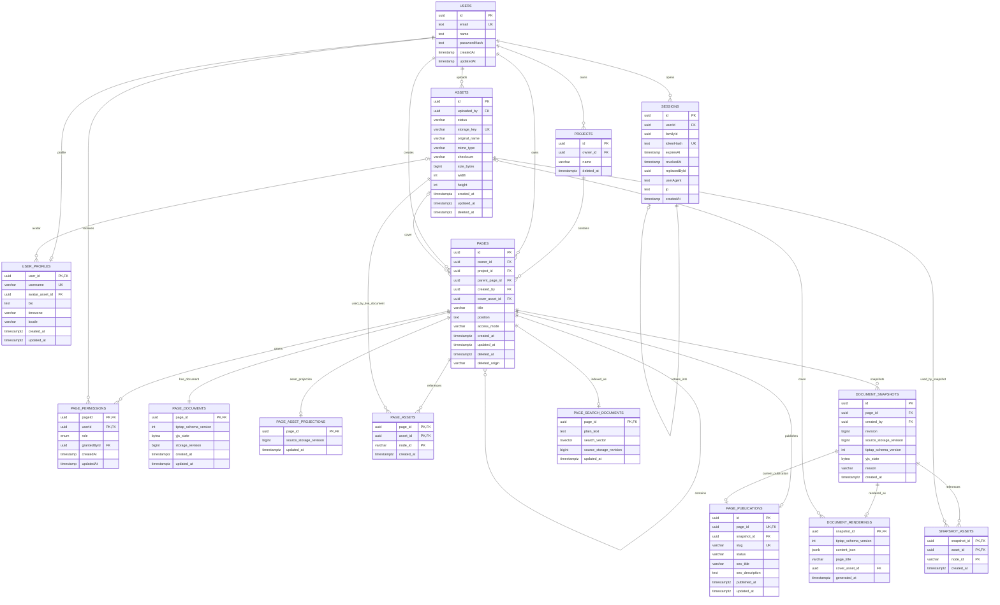

# Схема базы данных

> Обновлено: 15.09.2026  


## Статус и область документа

Этот документ описывает целевую модель базы данных для MVP и инварианты, которые должен сохранять прикладной слой.

Схема намеренно разделяет:

- авторитетное текущее состояние совместного документа;
- неизменяемые исторические снимки;
- производные проекции для поиска и assets;
- неизменяемые read-model для публикации;
- эфемерное realtime presence-состояние, которое не сохраняется в БД.

Статус реализации в `main` смешанный: `User`, `Session`, `Project`, `Page`, `PagePermission` и `PageDocument` уже существуют; assets, snapshots, publication и search входят в релизный scope и добавляются соответствующими issue. `USER_PROFILES` входит в целевую схему, но является P1 / optional.

Целевая схема не должна ослаблять инварианты, уже реализованные в `main`. В частности, текущее дерево страниц использует ограничение ownership/project по `(id, ownerId, projectId)`, а soft-delete использует `PageDeletionOrigin` (`SELF`, `PARENT_PAGE`, `PROJECT`).

Логические имена ниже используют документационную нотацию проекта. Существующие Prisma-модели физически используют camelCase-имена таблиц/полей вроде `User`, `Session`, `Project`, `Page`, `PagePermission`, `PageDocument`; миграции должны сохранять фактические соглашения репозитория.

---

# Основные принципы

## Владение проектом и страницами

Проект — граница владения, жизненного цикла и порядка корневых страниц.

Каждая страница принадлежит ровно одному проекту:

```text
PAGES.project_id NOT NULL
```

Корневая страница — обычная страница с:

```text
parent_page_id = NULL
```

Все страницы проекта имеют того же владельца, что и проект.

## Source of truth документа

TipTap — UI редактора над ProseMirror.

Yjs — CRDT-модель документа.

Авторитетное представление текущего содержимого страницы:

```text
Y.Doc
```

Постоянное представление:

```text
Y.encodeStateAsUpdate(ydoc)
    ↓
PAGE_DOCUMENTS.yjs_state BYTEA
```

TipTap JSON, plain text и ссылки на assets — производные представления. Они не должны становиться независимым source of truth для live-документа.

## Source of truth публикации

Опубликованная страница — это неизменяемый snapshot, а не отображение текущего live-документа.

```text
current Y.Doc
    ↓ Publish
DOCUMENT_SNAPSHOTS.yjs_state
    ↓ derive once
DOCUMENT_RENDERINGS.content_json
    ↓
PAGE_PUBLICATIONS.snapshot_id
```

Публичный запрос рендерит `DOCUMENT_RENDERINGS.content_json`; он не декодирует Yjs и не загружает collaboration/editor runtime.

## Общая проекция документа

Assets, Search и Publication не должны реализовывать независимые декодеры Yjs/TipTap-схемы.

Используется единая schema-aware граница проекции, концептуально:

```text
Y.Doc
  ↓
Document Projection
  ├── TipTap JSON     → publication rendering
  ├── asset refs      → PAGE_ASSETS / SNAPSHOT_ASSETS
  └── plain text      → PAGE_SEARCH_DOCUMENTS
```

---

# Диаграмма сущностей



---

# Пользователи и профили

## USERS

Существующая таблица identity/auth:

```text
id            uuid, PK
email         text, unique
name          text
passwordHash  text
createdAt     timestamp, default now()
updatedAt     timestamp, @updatedAt
```

Email нормализуется приложением до сохранения и поиска.

`USERS.name` остаётся каноническим редактируемым отображаемым именем. Не вводить второе поле `display_name` в `USER_PROFILES`; чтение профиля объединяет identity-поля из `USERS` и необязательные расширенные поля профиля.

## USER_PROFILES

Целевая модель расширенного профиля. Сущность **P1 / optional** и не должна задерживать Assets, Search или Publication.

```text
user_id          uuid, PK, FK → USERS.id, ON DELETE CASCADE
username         varchar, nullable, unique normalized
avatar_asset_id  uuid, nullable, FK → ASSETS.id
bio              text, nullable
timezone         varchar, nullable
locale           varchar, nullable
created_at       timestamptz
updated_at       timestamptz
```

Семантика профиля:

- `USERS.name` — редактируемое человекочитаемое имя, используемое в collaboration/presence/sharing UI;
- `USER_PROFILES.username` — необязательный уникальный handle; он не нужен для sharing/publication MVP;
- `avatar_asset_id` — приватный asset, доступ к которому идёт через Assets access layer;
- `bio`, `timezone`, `locale` — необязательная metadata профиля.

Строка профиля может создаваться лениво при первом обновлении профиля либо заранее, когда будет реализована profile feature. Пока строки нет, расширенные поля считаются пустыми/default.

Если avatar UI из #49 появится раньше остальной части profile UI, минимальную `USER_PROFILES` можно добавить в рамках интеграции Assets/Profile, не заставляя одновременно выпускать экраны username/bio/timezone/locale.

---

# Сессии

Существующая модель `Session` представляет одну выданную пару refresh-token.

```text
id            uuid, PK
userId        uuid, FK → USERS.id, ON DELETE CASCADE
familyId      uuid
tokenHash     text, unique
expiresAt     timestamp
revokedAt     timestamp, nullable
replacedById  uuid, nullable
userAgent     text, nullable
ip            text, nullable
createdAt     timestamp
```

Refresh tokens хранятся только в виде хешей.

`familyId` объединяет ротации одной логической цепочки device/session.

`replacedById` сейчас представляет application-level связь ротации; если в физической схеме по-прежнему нет self-FK, документация не должна утверждать, что такой constraint уже существует.

---

# Проекты

`PROJECTS` — граница владения, жизненного цикла и root-ordering.

```text
id          uuid, PK
owner_id    uuid, NOT NULL, FK → USERS.id
name        varchar
deleted_at  timestamptz, nullable
```

Обязательный инвариант:

```text
UNIQUE (id, owner_id)
```

Обычные операции приложения не меняют владельца проекта.

`deleted_at IS NOT NULL` означает soft-deleted.

---

# Страницы

```text
id               uuid, PK
project_id       uuid, NOT NULL
owner_id         uuid, NOT NULL
parent_page_id   uuid, nullable
created_by       uuid, NOT NULL
cover_asset_id   uuid, nullable        # planned in #47

title            varchar
position         text COLLATE "C"
access_mode      enum(inherit, restricted)

created_at       timestamptz
updated_at       timestamptz
deleted_at       timestamptz, nullable
deleted_origin   enum(SELF, PARENT_PAGE, PROJECT), nullable
```

`deleted_at` и `deleted_origin` — уже реализованная пара: у живой страницы оба поля `NULL`, у удалённой — оба `NOT NULL`. `deleted_origin` нужен текущей семантике корзины/restore и не должен удаляться релизными миграциями.

## Инвариант владения

```text
PROJECTS: UNIQUE (id, owner_id)

PAGES(project_id, owner_id)
    → PROJECTS(id, owner_id)
```

Это не позволяет странице иметь владельца, отличного от владельца проекта.

## Иерархия страниц

```text
PAGES: UNIQUE (id, owner_id, project_id)

PAGES(parent_page_id, owner_id, project_id)
    → PAGES(id, owner_id, project_id)
```

Это инвариант, уже реализованный в `main`: родитель и ребёнок должны находиться и в одном проекте, и в одной ownership boundary. `MATCH SIMPLE` позволяет корневые строки с `parent_page_id = NULL`. Нужно сохранять фактическую семантику существующего FK, включая migration-level deferrability, используемую для cross-project subtree move, а не заменять её более слабой связью по двум полям.

Циклы обычным FK не выражаются и предотвращаются application layer.

Перед изменением `parent_page_id`:

```text
newParent != page
newParent is not a descendant of page
```

## Порядок

Граница порядка siblings:

```text
project_id
parent_page_id
position
```

Использовать стабильную сортировку:

```sql
ORDER BY position, id
```

## Перенос между проектами

Поддерево можно переносить между проектами только если оба проекта принадлежат одному владельцу.

Операция транзакционная и обновляет `project_id` для всего поддерева одним statement/transaction. Существующий трёхколоночный FK parent/owner/project должен сохраняться валидным на всём протяжении операции; ослаблять его в релизных миграциях нельзя.

---

# Права доступа к страницам

Существующий `PagePermission` хранит прямые grants.

```text
pageId       uuid, PK, FK → Page.id, ON DELETE CASCADE
userId       uuid, PK, FK → User.id, ON DELETE CASCADE
role         enum(VIEWER, EDITOR)
grantedById  uuid, FK → User.id, ON DELETE RESTRICT
createdAt    timestamp
updatedAt    timestamp
```

Доступ владельца задаётся через `PAGES.owner_id`, а не через отдельную permission row с ролью `OWNER`.

## Эффективный доступ

До вычисления permissions проект и страница должны быть активны.

Алгоритм effective permission:

1. владелец получает полный доступ;
2. прямой permission на текущую страницу имеет приоритет;
3. `restricted` останавливает наследование;
4. `inherit` продолжает подъём к родителю;
5. root без подходящего permission недоступен.

Ближайший прямой permission побеждает, даже если он уже, чем grant на предке.

Publication не даёт доступ к рабочему редактору.

---
# PAGE_DOCUMENTS

Постоянное состояние активного collaborative document:

```text
page_id                 uuid, PK, FK → PAGES.id
tiptap_schema_version   int
yjs_state               bytea
storage_revision        bigint
created_at              timestamptz
updated_at              timestamptz
```

## yjs_state

Полное бинарное состояние Yjs:

```text
Y.encodeStateAsUpdate(ydoc)
```

TipTap JSON нельзя использовать для восстановления первичного collaborative state.

## tiptap_schema_version

Монотонная версия application schema для несовместимых изменений TipTap/ProseMirror.

Она меняется, когда несовместимо меняются типы nodes, marks, attrs или структурная schema.

## storage_revision

`storage_revision` — монотонно растущая версия успешно сохранённых полных состояний Yjs.

Это не sequence протокола Yjs и не номер каждого CRDT update.

```text
CHECK storage_revision >= 0
```

Derived projections используют её как freshness watermark:

```text
PAGE_ASSET_PROJECTIONS.source_storage_revision
PAGE_SEARCH_DOCUMENTS.source_storage_revision
DOCUMENT_SNAPSHOTS.source_storage_revision
```

---

# Persistence Hocuspocus

## Загрузка

```text
Hocuspocus
    ↓ onLoadDocument(pageId)
PAGE_DOCUMENTS.yjs_state
    ↓
Y.Doc
```

Если строки ещё нет, создаётся пустой Y.Doc с текущей версией схемы.

## Сохранение

```text
clients
   ↓
Hocuspocus
   ↓
Y.Doc in memory
   ↓ onStoreDocument
Y.encodeStateAsUpdate()
   ↓
PAGE_DOCUMENTS
```

`onStoreDocument` работает с debounce.

После успешного store:

```text
yjs_state        = new full state
storage_revision = storage_revision + 1
updated_at       = now()
```

Собственный durable incremental update log не входит в MVP.

---

# Аутентификация Hocuspocus и collaboration

Логическое имя документа:

```text
page:<page_id>
```

При аутентификации collaboration service:

1. валидирует access token;
2. определяет `user_id`;
3. определяет `page_id`;
4. вычисляет effective permission;
5. отклоняет доступ к недоступным страницам;
6. делает соединения viewer read-only;
7. разрешает editor/owner запись.

Presence/cursors — это Yjs Awareness state и в БД не сохраняются.

Не добавлять PostgreSQL-поля для позиции курсора, selection или online users.

Отзыв доступа должен влиять и на уже подключённые сессии; это требование application/collaboration lifecycle, а не новая сущность БД.

---

# Общая проекция документа

Одна schema-aware граница преобразует captured Y.Doc в переиспользуемые производные значения:

```text
CapturedDocument
├── yjs_state
├── storage_revision
├── tiptap_schema_version
├── tiptap_json
├── plain_text
└── asset_refs
```

Эта граница переиспользуется для:

- live asset projection;
- search projection;
- publication snapshot/rendering.

Одна publication operation должна получить snapshot binary, TipTap JSON и asset refs из одного и того же captured state.

---

# Assets

Физические объекты хранятся в приватном S3-compatible storage.

## ASSETS

```text
id             uuid, PK
uploaded_by    uuid, FK → USERS.id
status         enum(pending, ready, failed, deleted)
storage_key    varchar, unique
original_name  varchar
mime_type      varchar
checksum       varchar
size_bytes     bigint
width          int, nullable
height         int, nullable
created_at     timestamptz
updated_at     timestamptz
deleted_at     timestamptz, nullable
```

Постоянные public/signed URL не сохраняются.

Допустимый lifecycle:

```text
pending → ready
pending → failed
pending → deleted
ready   → deleted
failed  → deleted
```

Недопустимые переходы отклоняются application layer.

`storage_key` — внутреннее поле и никогда не должно попадать в public publication API.

## Avatar и cover

```text
USER_PROFILES.avatar_asset_id → ASSETS.id
PAGES.cover_asset_id          → ASSETS.id
```

Это live metadata references.

Для publication cover должен фиксироваться в immutable publication rendering; публичная страница не должна читать текущий live `PAGES.cover_asset_id` напрямую.

---

# Проекция assets live-документа

Ссылки на assets внутри Yjs проецируются в `PAGE_ASSETS`.

## PAGE_ASSET_PROJECTIONS

Watermark проекции:

```text
page_id                  uuid, PK, FK → PAGES.id
source_storage_revision  bigint, NOT NULL
updated_at               timestamptz
```

Эта таблица существует отдельно от `PAGE_ASSETS`, потому что документ может не содержать ни одной ссылки на asset, но при этом иметь успешно обработанную revision проекции.

Это позволяет отклонять stale/out-of-order jobs даже когда текущий набор assets пуст.

## PAGE_ASSETS

```text
page_id     uuid, PK, FK → PAGES.id
asset_id    uuid, PK, FK → ASSETS.id
node_id     varchar, PK
created_at  timestamptz
```

Рекомендуемый инвариант:

```text
PRIMARY KEY (page_id, asset_id, node_id)
```

Если `node_id` гарантированно уникален внутри одной страницы, дополнительный unique `(page_id, node_id)` можно использовать для обнаружения некорректного projection output.

## Обновление проекции

После успешного persistence Yjs:

```text
PAGE_DOCUMENTS revision N
    ↓
Document Projection
    ↓ asset refs
atomic refresh PAGE_ASSETS
    +
PAGE_ASSET_PROJECTIONS.source_storage_revision = N
```

Refresh должен быть транзакционным и защищённым revision guard.

Концептуально:

```text
current projection revision > incoming revision
→ ignore incoming job

current projection revision = incoming revision
→ idempotent/no-op or safe rebuild

current projection revision < incoming revision
→ replace refs and advance watermark atomically
```

Stale job не должен удалить asset refs из более новой projection.

---

# Retention assets и garbage collection

Физическое удаление допустимо только если объект больше не нужен ни одной активной ссылке.

Live references:

- `USER_PROFILES.avatar_asset_id`;
- `PAGES.cover_asset_id`;
- `PAGE_ASSETS`.

Published references:

- текущий опубликованный snapshot через `SNAPSHOT_ASSETS`;
- cover текущего publication rendering через `DOCUMENT_RENDERINGS.cover_asset_id`.

GC не должен считать все исторические строки `SNAPSHOT_ASSETS` вечной причиной хранения. Для publication retention релизно-критичны только refs snapshot, который сейчас выбран активной записью `PAGE_PUBLICATIONS(status = published)`.

Исторические snapshot refs могут оставаться в БД для трассировки, но больше не обязаны предотвращать физическое удаление, если будущая history-retention policy не потребует иного.

---

# Snapshots документа

## DOCUMENT_SNAPSHOTS

Неизменяемые исторические состояния Yjs:

```text
id                       uuid, PK
page_id                  uuid, FK → PAGES.id
created_by               uuid, FK → USERS.id
revision                 bigint
source_storage_revision  bigint
tiptap_schema_version    int
yjs_state                bytea
reason                   enum(automatic, manual, publication, restore)
created_at               timestamptz
```

Обязательные constraints:

```text
UNIQUE (page_id, revision)
UNIQUE (id, page_id)
```

Snapshot revisions последовательны и монотонно растут внутри страницы.

Параллельное создание snapshots должно достаточно сериализоваться/блокироваться, чтобы не возникали duplicate revisions.

Snapshot после создания неизменяем.

`source_storage_revision` — persisted revision документа, соответствующая captured Y.Doc.

При publication текущий in-memory Y.Doc может быть новее последнего debounced store. Collaboration layer должен сохранить/зафиксировать именно состояние публикации и вернуть соответствующий `storage_revision`; publication не должна записывать вводящую в заблуждение revision.

## Scope snapshots для MVP

Snapshot infrastructure обязательна для publication.

Полноценный history restore не входит в критический путь publication.

Будущий restore создаёт новый current Y.Doc и новый snapshot с `reason = restore`; старую историю snapshots он не переписывает.

---

# Производные renderings документа

## DOCUMENT_RENDERINGS

Неизменяемое public/read-optimized представление snapshot:

```text
snapshot_id              uuid, PK, FK → DOCUMENT_SNAPSHOTS.id
tiptap_schema_version    int
content_json             jsonb
page_title               varchar
cover_asset_id           uuid, nullable FK → ASSETS.id
generated_at             timestamptz
```

`content_json` — TipTap/ProseMirror JSON.

`page_title` и `cover_asset_id` — metadata, зафиксированная на момент publication. Это не позволяет public page смешивать immutable body content с live mutable полями `PAGES`.

`DOCUMENT_RENDERINGS` — derived representation и не является source of truth самого документа.

```text
DOCUMENT_SNAPSHOTS.yjs_state
        ↓ derive
DOCUMENT_RENDERINGS.content_json
```

Для automatic/manual snapshots rendering необязателен.

Для snapshot с:

```text
reason = publication
```

rendering должен существовать до того, как `PAGE_PUBLICATIONS` переключится на него.

---

# Ссылки assets в snapshot

## SNAPSHOT_ASSETS

Ссылки на content assets, зафиксированные из того же Y.Doc, из которого создаётся publication snapshot:

```text
snapshot_id  uuid, PK, FK → DOCUMENT_SNAPSHOTS.id
asset_id     uuid, PK, FK → ASSETS.id
node_id      varchar, PK
created_at   timestamptz
```

Рекомендуемый ключ:

```text
PRIMARY KEY (snapshot_id, asset_id, node_id)
```

Строки неизменяемы вместе со snapshot.

`SNAPSHOT_ASSETS` отделена от `PAGE_ASSETS`, потому что live page может удалить image после publication, а текущий публичный snapshot всё ещё должен ссылаться на этот asset.

Cover хранится напрямую в `DOCUMENT_RENDERINGS.cover_asset_id`, потому что cover — metadata страницы, а не content node TipTap/Yjs.

Публичный доступ к asset должен проверять, что запрошенный asset принадлежит текущему опубликованному snapshot либо является cover текущего publication rendering. Само знание `asset_id` не является разрешением на анонимный доступ.

---
# Publications

## PAGE_PUBLICATIONS

Одна запись publication на страницу:

```text
id               uuid, PK
page_id          uuid, unique, FK → PAGES.id
snapshot_id      uuid, nullable
slug             varchar, unique
status           enum(draft, published, unpublished)
seo_title        varchar, nullable
seo_description  text, nullable
published_at     timestamptz, nullable
updated_at       timestamptz
```

Обязательная согласованность:

```text
PAGE_PUBLICATIONS(snapshot_id, page_id)
    → DOCUMENT_SNAPSHOTS(id, page_id)
```

с использованием:

```text
UNIQUE (DOCUMENT_SNAPSHOTS.id, DOCUMENT_SNAPSHOTS.page_id)
```

Для `status = published`:

- `snapshot_id` не `NULL`;
- `published_at` не `NULL`;
- существует соответствующий `DOCUMENT_RENDERINGS(snapshot_id)`;
- publication asset refs для snapshot успешно построены.

Последние два инварианта обеспечиваются application transaction публикации.

## Slug

Для MVP publication slug глобально уникален.

Server-side validation/normalization является авторитетной.

## Семантика publish

Операция publish/republish должна использовать одно консистентно зафиксированное состояние документа.

```text
1. Check editor/owner permission.
2. Ask collaboration layer for current authoritative Y.Doc.
3. Persist/capture that exact state and obtain storage_revision.
4. From the same captured state derive:
   - Yjs binary snapshot;
   - TipTap JSON;
   - content asset refs.
5. Capture publication metadata:
   - page title;
   - cover asset id.
6. In one DB transaction:
   - create DOCUMENT_SNAPSHOT(reason = publication);
   - create DOCUMENT_RENDERING;
   - create SNAPSHOT_ASSETS;
   - create/update PAGE_PUBLICATIONS to the new snapshot;
   - set status = published;
   - set published_at.
7. Commit.
8. Revalidate public Next.js route/cache after commit.
```

Publication pointer не должен переключаться до готовности snapshot, rendering и asset refs.

## Republish

Republish всегда создаёт новый immutable snapshot/rendering.

```text
snapshot 5 ← currently public
live document changes
Republish
    ↓
snapshot 6 + rendering 6 + refs 6
    ↓
PAGE_PUBLICATIONS.snapshot_id = 6
```

До commit snapshot 5 остаётся валидной публичной версией.

## Unpublish

Unpublish переводит status в `unpublished`.

Исторические snapshot/rendering rows удалять не требуется.

Public route трактует unpublished records как not found.

## Взаимодействие с soft delete

Удаление page/project не должно оставлять публичную страницу доступной.

Для MVP soft delete явно переводит существующую publication в `unpublished` в рамках того же application lifecycle operation либо эквивалентного гарантированного workflow.

Restore не выполняет автоматический republish.

Это предотвращает ситуацию, когда восстановленная private page снова становится public без явного действия пользователя.

---

# Публичный рендеринг

Public route:

```text
GET /p/:slug
    ↓
PAGE_PUBLICATIONS(status = published)
    ↓
snapshot_id
    ↓
DOCUMENT_RENDERINGS
    ↓
@tiptap/static-renderer
    ↓
React / HTML
```

Публичная страница не должна использовать:

- `PAGE_DOCUMENTS`;
- current Y.Doc;
- Hocuspocus;
- Awareness/presence;
- editable TipTap instance;
- editor NodeViews.

Она рендерит immutable `content_json` через общие presentation components.

Она использует `DOCUMENT_RENDERINGS.page_title/cover_asset_id`, а не live metadata страницы, если только продукт в будущем явно не выберет live field.

Object storage остаётся приватным. Public media разрешаются через publication-aware backend access с короткоживущими delivery URL либо эквивалентным контролируемым механизмом.

---

# Поиск

## PAGE_SEARCH_DOCUMENTS

Производное поисковое представление:

```text
page_id                  uuid, PK, FK → PAGES.id
plain_text               text
search_vector            tsvector
source_storage_revision  bigint
updated_at               timestamptz
```

`plain_text` извлекается из persisted Yjs через общую document projection.

`source_storage_revision` отражает freshness body content.

Если:

```text
PAGE_SEARCH_DOCUMENTS.source_storage_revision
<
PAGE_DOCUMENTS.storage_revision
```

content projection устарела, но остаётся валидным предыдущим derived state.

## Поиск по title + content

Поиск работает одновременно по:

- текущему `PAGES.title`;
- persisted document text.

Title имеет больший либо равный ranking weight по сравнению с body text.

Переименование title должно обновлять searchable representation без ожидания нового Yjs store.

Реализация может перестраивать `search_vector` из текущего `PAGES.title` + сохранённого `plain_text`, если concurrent обновления title/body сериализуются безопасно и stale body jobs не могут перезаписать более новую body revision.

Архитектура БД/приложения не должна требовать ручного сохранения редактора, чтобы новое название стало searchable.

## Обновление проекции

После успешного Hocuspocus store:

```text
PAGE_DOCUMENTS revision N
    ↓
Document Projection
    ↓ plain_text
revision-guarded PAGE_SEARCH_DOCUMENTS update
```

Stale/out-of-order job не должен заменить row, построенную из более новой storage revision.

Ошибка projection не должна откатывать успешное Yjs persistence.

## Backfill / rebuild

Search должен поддерживать идемпотентный rebuild для уже существующих документов.

Rebuild читает текущий persisted `PAGE_DOCUMENTS`, извлекает plain text и обновляет projection только если это не перезаписывает более новую версию.

Тот же механизм можно использовать после будущих изменений search/schema logic.

## Авторизация поиска

Search index не является authorization boundary.

Перед возвратом результатов:

1. project активен;
2. page активна;
3. текущий пользователь имеет effective page permission.

Нельзя возвращать inaccessible titles, excerpts, project names или ancestor metadata, а затем фильтровать их на клиенте.

Если API возвращает breadcrumb/path metadata, она должна строиться permission-safe.

## Индекс

```text
PAGE_SEARCH_DOCUMENTS USING GIN(search_vector)
```

Если позже появится отдельное FTS expression/index для title, оно должно использовать ту же выбранную конфигурацию PostgreSQL FTS.

---

# Soft delete и restore

Текущая реализация использует для pages и `deleted_at`, и `deleted_origin`. Origin — не служебная metadata: он определяет корни корзины и границы восстановления.

## PageDeletionOrigin

```text
SELF         — страница была явно удалена сама; это корень корзины
PARENT_PAGE  — живая дочерняя страница удалена из-за удаления ancestor page
PROJECT      — живая страница удалена из-за удаления проекта
```

Обязательный инвариант:

```text
(deleted_at IS NULL AND deleted_origin IS NULL)
OR
(deleted_at IS NOT NULL AND deleted_origin IS NOT NULL)
```

## Удаление поддерева страницы

Удаление живой страницы помечает выбранный root как `SELF`, а её текущих живых descendants — как `PARENT_PAGE` в одной транзакции. Traversal удаления не проходит через уже удалённое поддерево, поэтому независимо удалённый descendant с `SELF` остаётся отдельным корнем корзины.

`parent_page_id` и `position` сохраняются для restore; soft delete физически не отсоединяет subtree.

## Восстановление поддерева страницы

Restore корня корзины с `SELF` очищает deletion у самого root и descendants, принадлежащих его deletion group. Descendant с `deleted_origin = SELF` остаётся удалённым и сохраняется как отдельный root корзины.

Это сохраняет уже реализованное поведение и не восстанавливает страницы, которые пользователь независимо удалил до удаления ancestor.

## Удаление / восстановление проекта

Удаление проекта устанавливает `PROJECTS.deleted_at` и помечает только текущие живые страницы `deleted_origin = PROJECT`. Страницы, удалённые ранее, сохраняют свой исходный deletion origin.

Restore проекта очищает deletion только у страниц с `deleted_origin = PROJECT`. Ранее независимо удалённые `SELF` roots остаются в корзине.

## Взаимодействие с search, collaboration и publication

Удалённые projects/pages исключаются из обычных reads, permissions, collaboration и search. Search projections могут физически оставаться в БД; после restore существующая projection снова может стать eligible без editor save.

Релизное правило publication: удаление page/project должно делать public route недоступным. Если #52 реализует это переводом publication в `unpublished`, restore не должен неявно выполнять republish.

Permissions и Yjs content сохраняются при soft delete. Physical deletion — более поздняя retention/GC operation.

---

# Ограничения базы данных

Для ограниченных доменов использовать Prisma enums либо PostgreSQL CHECK constraints:

```text
PagePermissionRole
PageAccessMode
PageDeletionOrigin
AssetStatus
PublicationStatus
SnapshotReason
```

Обязательные/целевые constraints:

```text
UNIQUE USERS.email
UNIQUE USER_PROFILES.user_id
UNIQUE normalized USER_PROFILES.username WHERE username IS NOT NULL
UNIQUE SESSIONS.tokenHash

SESSIONS.userId
    → USERS.id ON DELETE CASCADE

PROJECTS.owner_id IS NOT NULL
UNIQUE (PROJECTS.id, PROJECTS.owner_id)

PAGES.project_id IS NOT NULL
PAGES.owner_id IS NOT NULL

PAGES(project_id, owner_id)
    → PROJECTS(id, owner_id)

UNIQUE (PAGES.id, PAGES.owner_id, PAGES.project_id)

PAGES(parent_page_id, owner_id, project_id)
    → PAGES(id, owner_id, project_id)

CHECK (
    (PAGES.deleted_at IS NULL AND PAGES.deleted_origin IS NULL)
    OR
    (PAGES.deleted_at IS NOT NULL AND PAGES.deleted_origin IS NOT NULL)
)

PRIMARY KEY (PagePermission.pageId, PagePermission.userId)

PAGE_DOCUMENTS.storage_revision >= 0

PRIMARY KEY PAGE_ASSET_PROJECTIONS(page_id)
PRIMARY KEY PAGE_ASSETS(page_id, asset_id, node_id)

UNIQUE (DOCUMENT_SNAPSHOTS.page_id, revision)
UNIQUE (DOCUMENT_SNAPSHOTS.id, page_id)

DOCUMENT_RENDERINGS.snapshot_id
    → DOCUMENT_SNAPSHOTS.id

PRIMARY KEY SNAPSHOT_ASSETS(snapshot_id, asset_id, node_id)

UNIQUE ASSETS.storage_key

UNIQUE PAGE_PUBLICATIONS.page_id
UNIQUE PAGE_PUBLICATIONS.slug

PAGE_PUBLICATIONS(snapshot_id, page_id)
    → DOCUMENT_SNAPSHOTS(id, page_id)

PRIMARY KEY PAGE_SEARCH_DOCUMENTS(page_id)
```

Application-level transaction invariants дополнительно гарантируют:

- опубликованная publication всегда имеет готовый rendering;
- snapshot asset refs готовы до переключения publication pointer;
- циклы невозможны;
- project ownership не меняется обычными move operations;
- cross-project move разрешён только между проектами одного owner;
- active child под deleted parent невозможен;
- soft delete делает текущую publication недоступной;
- stale projection jobs не могут перезаписать более новые revisions.

---
# Обязательные индексы

Минимальный целевой набор:

```text
USER_PROFILES(avatar_asset_id)

SESSIONS(userId)
SESSIONS(familyId)
SESSIONS(expiresAt)

PAGES(project_id, parent_page_id, position, id)
    WHERE deleted_at IS NULL

PAGES(project_id, updated_at)
    WHERE deleted_at IS NULL

PAGES(deleted_at)
PAGES(created_by)

PagePermission(userId, pageId)
PagePermission(grantedById)

PAGE_ASSET_PROJECTIONS(source_storage_revision)
PAGE_ASSETS(asset_id)

DOCUMENT_SNAPSHOTS(page_id, revision DESC)
DOCUMENT_SNAPSHOTS(page_id, source_storage_revision DESC)

DOCUMENT_RENDERINGS(cover_asset_id)

SNAPSHOT_ASSETS(asset_id)

PAGE_PUBLICATIONS(slug)
PAGE_PUBLICATIONS(status, snapshot_id)

ASSETS(uploaded_by, deleted_at)

PAGE_SEARCH_DOCUMENTS USING GIN(search_vector)
```

PostgreSQL не создаёт индексы для FK-колонок автоматически, поэтому access paths по внешним ключам, используемые retention/query flows, нужно явно создавать в миграциях.

---

# Архитектура приложения

```text
Next.js
│
├── HTTP
│   ↓
│  NestJS
│  ├── auth
│  ├── users / profiles
│  ├── projects
│  ├── pages / hierarchy
│  ├── permissions
│  ├── assets
│  ├── snapshots
│  ├── publishing
│  └── search
│
└── WebSocket
    ↓
   Collaboration service / Hocuspocus
   ├── Yjs sync
   ├── realtime collaboration
   ├── awareness / cursors
   ├── authentication
   ├── read-only connections
   ├── access-revoke handling
   └── Yjs persistence
```

PostgreSQL — общее постоянное хранилище.

Collaboration service является authority для текущего in-memory состояния Y.Doc. NestJS владеет business commands для assets, search, snapshots и publication и взаимодействует с collaboration layer через явную internal boundary, когда ему нужен current document.

---

# Отложенные сущности и возможности

`USER_PROFILES` намеренно **не** находится в этом списке: он входит в целевую схему, но полноценный UI/API профиля имеет приоритет P1 и может быть отложен, если есть риск для release-critical path.

Не обязательны для MVP:

```text
comments / threads
tasks as independent DB entities
calendar events
notifications
invitations
audit log
AI generation history
durable incremental Yjs update log
publication analytics
password-protected publications
expiring public links
custom domains
semantic/vector search
advanced asset/media processing
```

TipTap `taskItem` не требует отдельной таблицы `TASK`, пока не становится самостоятельной бизнес-сущностью со своим lifecycle, queries и ownership.

Persistent presence по-прежнему не хранится в БД.

---

# Итоговая модель документа

```text
                       LIVE-РЕДАКТОР

TipTap
  ↓
ProseMirror
  ↓
Y.Doc
  ↕
Hocuspocus
  ↓
PAGE_DOCUMENTS.yjs_state
       │
       ├──────── document projection ────────┐
       │                                     │
       │                                     ├─ PAGE_ASSETS
       │                                     │   + PAGE_ASSET_PROJECTIONS
       │                                     │
       │                                     └─ PAGE_SEARCH_DOCUMENTS
       │
       │ publication/history
       ▼
DOCUMENT_SNAPSHOTS.yjs_state
       │
       ├──────────► SNAPSHOT_ASSETS
       │
       ▼
DOCUMENT_RENDERINGS
├─ content_json
├─ page_title
└─ cover_asset_id
       │
       ▼
PAGE_PUBLICATIONS
       │
       ▼
Next.js Server Component
       │
       ▼
@tiptap/static-renderer
       │
       ▼
Public HTML / React
```

Ключевое правило:

```text
Yjs binary
=
авторитетное collaborative/historical состояние документа

TipTap JSON / plain text / asset references
=
производное read/projection state
```

Live document никогда не восстанавливается из derived JSON.

Публичная страница не декодирует Yjs при каждом запросе; она рендерит неизменяемое материализованное представление, созданное во время publish.
