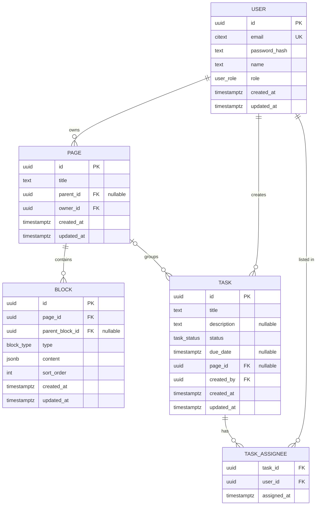
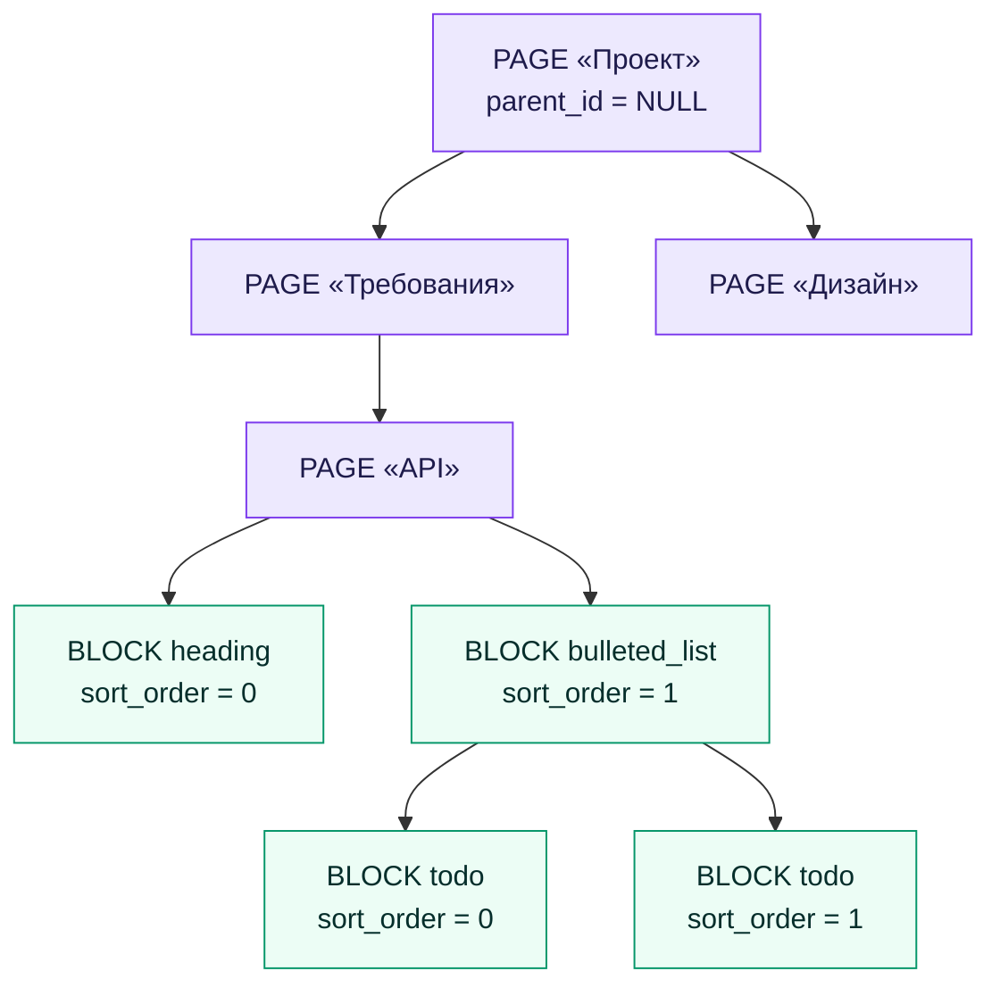

# Схема базы данных

Проектная схема PostgreSQL для MVP. Источник требований — issue [#9 «Спроектировать БД»](https://github.com/itbooster-project-group/lite-notion/issues/9).

Схема ещё не реализована: `schema.prisma` и миграции появятся отдельной задачей после согласования диаграммы.

## ER-диаграмма

Кардинальность `|o` на связи `PAGE → TASK` отражает nullable внешний ключ: задача может существовать без привязки к странице.

Самоссылающиеся связи `PAGE.parent_id → PAGE` и `BLOCK.parent_block_id → BLOCK` вынесены из диаграммы выше и показаны отдельно в разделе «Вложенность» — так структура читается нагляднее.

## Вложенность

Страницы и блоки образуют деревья произвольной глубины. Страница без родителя (`parent_id = NULL`) — это верхнеуровневый документ; блок без родителя (`parent_block_id = NULL`) находится на верхнем уровне страницы. Порядок блоков в пределах одного уровня задаётся полем `sort_order`.

## Enum-типы

| Тип | Значения | Назначение |
| --- | --- | --- |
| `user_role` | `GUEST`, `USER` | Роль пользователя на уровне приложения |
| `block_type` | `paragraph`, `heading`, `todo`, `bulleted_list`, `numbered_list` | Типы контент-блоков, поддерживаемые MVP |
| `task_status` | `TODO`, `IN_PROGRESS`, `DONE` | Статус задачи |

## Сущности

### USER

Пользователь приложения. Роль определяет уровень доступа: `USER` работает со своими страницами и задачами, `GUEST` получает read-only доступ к опубликованным страницам.

| Поле | Тип | Описание |
| --- | --- | --- |
| `id` | `uuid` PK | Первичный ключ |
| `email` | `citext` UK | Уникальный адрес, регистронезависимое сравнение |
| `password_hash` | `text` | Хеш пароля |
| `name` | `text` | Отображаемое имя |
| `role` | `user_role` | `GUEST` или `USER` |

### PAGE

Страница, она же документ. Отдельной сущности `Document` нет: верхнеуровневый документ — это `PAGE` с `parent_id = NULL`, как в Notion. Вложенность произвольной глубины через self-relation.

В MVP страница принадлежит одному владельцу. Таблица коллабораторов не проектируется: совместное редактирование вне скоупа, а гостевой доступ выдаётся по публичной ссылке и не требует записей в БД.

| Поле | Тип | Описание |
| --- | --- | --- |
| `id` | `uuid` PK | Первичный ключ |
| `title` | `text` | Заголовок страницы |
| `parent_id` | `uuid` FK, nullable | Родительская страница, `NULL` для корневой |
| `owner_id` | `uuid` FK | Владелец страницы |

### BLOCK

Контент-блок внутри страницы. Вкладывается в другой блок через `parent_block_id`, порядок в пределах уровня задаётся полем `sort_order`.

Поле называется `sort_order`, а не `order`, потому что `ORDER` — зарезервированное слово в PostgreSQL.

Содержимое хранится в `jsonb`: у разных типов блоков разная форма контента, и такой подход позволяет добавлять новые типы без миграции схемы.

| Поле | Тип | Описание |
| --- | --- | --- |
| `id` | `uuid` PK | Первичный ключ |
| `page_id` | `uuid` FK | Страница, которой принадлежит блок |
| `parent_block_id` | `uuid` FK, nullable | Родительский блок, `NULL` для блока верхнего уровня |
| `type` | `block_type` | Тип блока |
| `content` | `jsonb` | Содержимое, форма зависит от типа |
| `sort_order` | `int` | Порядок среди соседних блоков |

### TASK

Задача управления проектами, независимая от страниц. Связь с `PAGE` необязательная: в MVP страницы не шерятся, поэтому исполнитель задачи не обязательно имеет доступ к странице, и жёсткая привязка создавала бы недоступный контекст.

| Поле | Тип | Описание |
| --- | --- | --- |
| `id` | `uuid` PK | Первичный ключ |
| `title` | `text` | Заголовок задачи |
| `description` | `text`, nullable | Описание |
| `status` | `task_status` | Текущий статус |
| `due_date` | `timestamptz`, nullable | Срок выполнения |
| `page_id` | `uuid` FK, nullable | Необязательная привязка к странице |
| `created_by` | `uuid` FK | Автор задачи |

### TASK_ASSIGNEE

Junction-таблица для связи many-to-many между задачами и исполнителями. У одной задачи может быть несколько исполнителей.

| Поле | Тип | Описание |
| --- | --- | --- |
| `task_id` | `uuid` FK | Задача |
| `user_id` | `uuid` FK | Исполнитель |
| `assigned_at` | `timestamptz` | Момент назначения |

## Ключевые решения

- **Единая `PAGE` вместо пары `Document` + `Page`.** Соответствует модели Notion и убирает лишний уровень абстракции: любой документ — просто страница без родителя.
- **`jsonb` для содержимого блока.** Разные типы блоков имеют разную структуру контента; добавление нового типа не потребует миграции.
- **`sort_order` вместо `order`.** `ORDER` зарезервировано в PostgreSQL.
- **Nullable `Task.page_id`.** Задача может существовать вне страницы, что снимает противоречие между несколькими исполнителями задачи и отсутствием шеринга страниц в MVP.
- **Нет таблицы коллабораторов.** В MVP у страницы один владелец; совместный доступ — отдельная будущая задача.

## Вне скоупа MVP

- `schema.prisma`, миграции и индексы
- Совместный доступ к страницам и права уровня документа
- История версий и edit history
- Аутентификация и авторизация: токены, сессии
- Модели данных для Redis, BullMQ и Socket.IO
- Полнотекстовый поиск, теги, избранное, корзина
