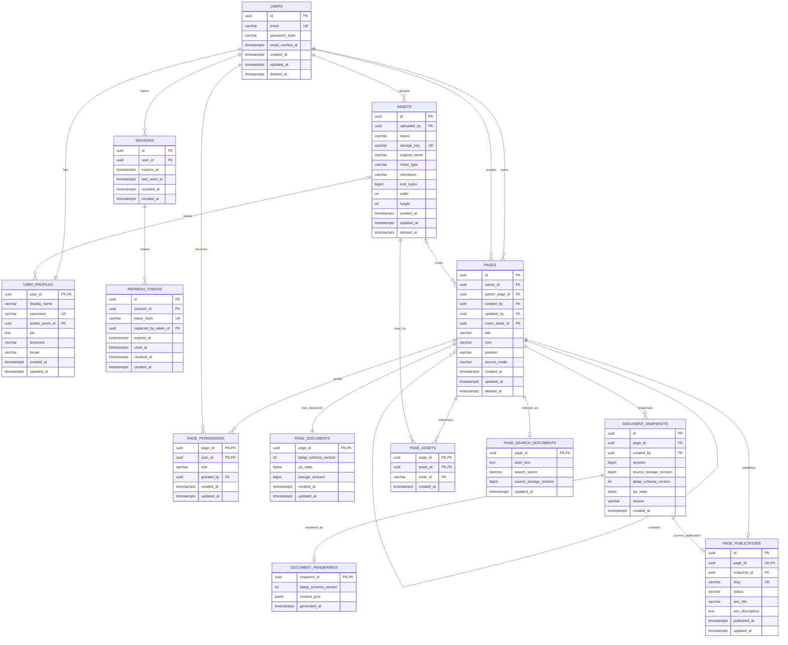

# Database Schema

## Общая структура

Основная единица организации данных — `PAGE`.

Верхнеуровневая страница является корнем дерева и определяется как:

```text
parent_page_id = NULL
```

Все дочерние страницы принадлежат тому же владельцу дерева, что и их родитель.

Содержимое страницы редактируется через **TipTap поверх ProseMirror**. Совместное редактирование, CRDT-состояние, синхронизация и presence построены на **Yjs + Hocuspocus**.

Источник истины для редактируемого содержимого страницы — **Yjs document**.

PostgreSQL хранит бинарное состояние Yjs. TipTap/ProseMirror JSON не является независимым authoritative source для рабочего документа.

Исключение — immutable snapshots публикации: для них дополнительно хранится **derived TipTap JSON representation**, используемый Next.js для server-side static rendering публичных страниц.



## Users and profiles

`USERS` хранит только данные идентификации, авторизации и жизненного цикла записи:

```text
email
password_hash
email_verified_at
created_at
updated_at
deleted_at
```

Логическое удаление:

```text
deleted_at IS NOT NULL
```

Email должен нормализоваться перед сохранением. Уникальность email и username должна быть регистронезависимой.

`USER_PROFILES` содержит пользовательские настройки и публичные данные:

```text
display_name
username
avatar_asset_id
bio
timezone
locale
```

## Sessions and refresh tokens

`SESSIONS` представляет пользовательское устройство или логическую авторизованную сессию.

Сессия может быть завершена через:

```text
SESSIONS.revoked_at
```

Refresh-токены хранятся отдельно в `REFRESH_TOKENS`. В базе сохраняется только hash.

При ротации:

1. использованный refresh token получает `used_at`;
2. создаётся новый refresh token;
3. старый token связывается с новым через `replaced_by_token_id`;
4. повторное использование старого token может приводить к отзыву всей session.

Access token короткоживущий и в БД не хранится.

---

## Pages

Верхнеуровневая заметка — обычная запись `PAGES`:

```text
PAGES.parent_page_id = NULL
```

Она является корнем дерева страниц.

Каждая страница содержит:

```text
owner_id
parent_page_id
created_by
updated_by
```

`owner_id` — владелец всего дерева страниц, а не обязательно пользователь, создавший конкретную дочернюю страницу.

Для root page:

```text
owner_id = владелец дерева
parent_page_id = NULL
```

Для дочерней страницы `owner_id` должен совпадать с `owner_id` родителя.

`created_by` и `updated_by` отражают фактических авторов операций и могут отличаться от `owner_id`, поскольку страница может редактироваться совместно.

---

## Page hierarchy

Иерархия строится только через self-reference:

```text
PAGES.parent_page_id
    ↓
PAGES.id
```

Для проверки принадлежности одному дереву рекомендуется составной FK:

```text
(parent_page_id, owner_id)
    ↓
(id, owner_id)
```

Для этого на `PAGES` необходим:

```text
UNIQUE (id, owner_id)
```

Приложение дополнительно должно запрещать циклы:

```text
A → B → C → A
```

Перемещение subtree к странице другого `owner_id` в первой версии запрещено.

Transfer дерева другому владельцу является отдельной транзакционной операцией.

---

## Page ordering

`PAGES.position` хранит fractional rank.

Для дочерних страниц порядок определяется внутри одного родителя:

```text
parent_page_id
position
```

Для root pages пользователя:

```text
owner_id
parent_page_id = NULL
position
```

Перемещение страницы и изменение порядка выполняются транзакционно.

---

## Page permissions

`PAGE_PERMISSIONS` хранит прямые разрешения пользователя на конкретную страницу.

Роли MVP:

* `viewer` — просмотр;
* `editor` — просмотр и редактирование.

`PAGES.owner_id` всегда имеет полный доступ к странице и её subtree.

`PAGES.access_mode`:

* `inherit` — если прямого разрешения нет, доступ ищется у родительской страницы;
* `restricted` — наследование останавливается на текущей странице.

Эффективный доступ определяется следующим образом:

1. если `user_id = PAGES.owner_id`, предоставляется полный доступ;
2. проверяется прямой `PAGE_PERMISSIONS`;
3. при `access_mode = restricted` поиск прекращается;
4. при `access_mode = inherit` проверяется parent page;
5. root page без подходящего разрешения недоступна;
6. публичная публикация не предоставляет доступ к рабочему редактору.

При перемещении страницы проверяются права на саму страницу, текущего родителя, нового родителя и принадлежность одному `owner_id`.

---

# TipTap + Yjs + Hocuspocus

## Source of truth

TipTap используется как UI/editor layer поверх ProseMirror.

Yjs является CRDT-моделью содержимого документа.

Hocuspocus отвечает за:

```text
WebSocket transport
Yjs sync protocol
document rooms
authentication
read-only connections
reconnect
Awareness / presence
persistence lifecycle
```

Не используется отдельный Socket.IO transport для совместного редактирования документа.

Не следует одновременно хранить независимые authoritative-копии:

```text
TipTap JSON
HTML
Markdown
Yjs document
```

Authoritative source редактируемого документа:

```text
Y.Doc
```

Persistent representation:

```text
Y.encodeStateAsUpdate(ydoc)
    ↓
PAGE_DOCUMENTS.yjs_state BYTEA
```

TipTap JSON рабочего документа может строиться из Yjs для projections, search, export или publication, но не используется для восстановления primary collaborative state.

Таблица `BLOCKS` не нужна.

---

# PAGE_DOCUMENTS

`PAGE_DOCUMENTS` хранит persistent state активного collaborative document:

```text
page_id
tiptap_schema_version
yjs_state
storage_revision
created_at
updated_at
```

## yjs_state

Полное бинарное состояние Yjs:

```ts
Y.encodeStateAsUpdate(ydoc)
```

В PostgreSQL хранится как:

```text
BYTEA
```

При загрузке Hocuspocus возвращает это состояние как `Uint8Array` / `Y.Doc`.

JSON не должен использоваться для обратного восстановления рабочего Yjs document.

## tiptap_schema_version

Версия TipTap/ProseMirror schema:

```text
1
2
3
...
```

Версия меняется при несовместимых изменениях extensions:

```text
node types
mark types
attrs
document schema
```

Она нужна для контролируемой миграции сохранённых документов.

## storage_revision

`storage_revision` — монотонная версия **persisted state**, а не каждого CRDT update.

Она увеличивается при успешном сохранении нового полного состояния через Hocuspocus persistence layer.

Например:

```text
31
32
33
```

Она используется для определения актуальности derived projections:

```text
PAGE_SEARCH_DOCUMENTS.source_storage_revision
DOCUMENT_SNAPSHOTS.source_storage_revision
```

Это не часть Yjs protocol и не влияет на CRDT merge.

---

# Hocuspocus persistence

Primary persistence реализуется через Hocuspocus:

```text
onLoadDocument
onStoreDocument
```

или через совместимый Database extension.

### Load

При открытии room:

```text
Hocuspocus
    ↓
onLoadDocument(pageId)
    ↓
PAGE_DOCUMENTS.yjs_state
    ↓
Y.Doc
```

Если документ ещё не существует, создаётся пустой Y.Doc с актуальной `tiptap_schema_version`.

### Store

При изменениях:

```text
clients
   ↓
Hocuspocus
   ↓
Y.Doc in memory
   ↓
onStoreDocument
   ↓
Y.encodeStateAsUpdate()
   ↓
PAGE_DOCUMENTS
```

`onStoreDocument` является debounced persistence hook, поэтому база не обновляется после каждого введённого символа.

При каждом успешном store:

```text
yjs_state = новое полное бинарное состояние
storage_revision = storage_revision + 1
updated_at = now()
```

В MVP не требуется собственный журнал:

```text
DOCUMENT_UPDATES
sequence
last_sequence
compacted_sequence
custom compactor
```

Если позже появится требование хранить durable operation log, incremental updates, audit history или point-in-time recovery между snapshots, `DOCUMENT_UPDATES` может быть добавлена отдельным расширением storage architecture.

---

# Hocuspocus authentication

Клиент подключается к room документа с authentication token.

Логическое имя документа рекомендуется строить из стабильного идентификатора page:

```text
page:<page_id>
```

В `onAuthenticate` collaboration server:

1. валидирует access token;
2. получает `user_id`;
3. извлекает `page_id` из document name;
4. вычисляет effective permission;
5. запрещает соединение, если доступа нет;
6. для `viewer` выставляет connection в read-only;
7. для `editor` разрешает изменения.

Владельцу страницы всегда доступен read/write режим.

Бизнес-правила разрешений принадлежат application layer и должны использовать ту же модель, что REST API NestJS.

---

# Realtime collaboration

Presence и cursors через Yjs Awareness **не сохраняются в PostgreSQL**.

В БД не нужны:

```text
cursor_position
current_selection
online_users
awareness_state
```

Это ephemeral state Hocuspocus/WebSocket соединений.

После reconnect клиент синхронизируется через Yjs protocol, а не через ручное сравнение TipTap JSON.

При горизонтальном масштабировании collaboration layer может использовать Redis/pub-sub, но для single-instance MVP Redis не является обязательной частью persistence модели.

---

# TipTap document structure

Типы nodes и marks определяются TipTap extensions.

Пример nodes:

```text
paragraph
heading
text
bulletList
orderedList
taskList
taskItem
image
video
file
callout
...
```

Marks:

```text
bold
italic
strike
code
link
...
```

PostgreSQL не создаёт отдельную строку для каждого paragraph/heading/block.

Для media и custom nodes рекомендуется стабильный `node_id` и/или `asset_id` в attrs TipTap node.

Например:

```json
{
  "type": "image",
  "attrs": {
    "id": "node-id",
    "assetId": "asset-id"
  }
}
```

---

# Document history

`DOCUMENT_SNAPSHOTS` хранит immutable контрольные версии документа:

```text
id
page_id
created_by
revision
source_storage_revision
tiptap_schema_version
yjs_state
reason
created_at
```

`revision` — последовательный номер версии для UI истории.

Constraint:

```text
UNIQUE (page_id, revision)
```

`reason`:

```text
automatic
manual
publication
restore
```

Snapshot является полным бинарным Yjs state:

```text
Y.encodeStateAsUpdate(ydoc)
```

`source_storage_revision` показывает persisted revision рабочего документа, от которого был создан snapshot.

История snapshots является отдельным продуктовым механизмом и не должна смешиваться с частотой `onStoreDocument`.

Automatic snapshot может создаваться, например:

```text
периодически
после достаточно длительной активности
перед значимыми операциями
```

но не при каждом сохранении Hocuspocus.

Restore старой версии не переписывает историю назад.

Восстановление:

```text
old snapshot
    ↓
new current Y.Doc
    ↓
new DOCUMENT_SNAPSHOT(reason = restore)
```

---

# Derived document renderings

`DOCUMENT_RENDERINGS` хранит **derived representation** immutable snapshot:

```text
snapshot_id
tiptap_schema_version
content_json
generated_at
```

`content_json` — TipTap/ProseMirror JSON.

Пример:

```json
{
  "type": "doc",
  "content": [
    {
      "type": "heading",
      "attrs": {
        "level": 1
      },
      "content": [
        {
          "type": "text",
          "text": "Public page"
        }
      ]
    }
  ]
}
```

Эта таблица **не является source of truth документа**.

Связь:

```text
DOCUMENT_SNAPSHOTS.yjs_state
        ↓ derive
DOCUMENT_RENDERINGS.content_json
```

Authoritative historical representation остаётся:

```text
DOCUMENT_SNAPSHOTS.yjs_state
```

`content_json` является материализованным read-model, который нужен для быстрого server-side rendering.

Для обычных automatic/manual snapshots `DOCUMENT_RENDERINGS` создавать необязательно.

Для snapshot с:

```text
reason = publication
```

rendering должен быть сформирован до того, как публикация станет публичной.

Если derived JSON потерян или его нужно пересоздать после миграции, он может быть заново построен из `DOCUMENT_SNAPSHOTS.yjs_state`.

---

# Page publication

Публичная публикация отделена от рабочего Yjs document.

`PAGE_PUBLICATIONS` хранит:

```text
page_id
snapshot_id
slug
status
seo_title
seo_description
published_at
updated_at
```

Статусы:

```text
draft
published
unpublished
```

Публичная страница всегда указывает на конкретный immutable `DOCUMENT_SNAPSHOT`.

Изменения рабочего realtime document после публикации не должны становиться публичными автоматически.

```text
live Y.Doc
   │
   │ Publish
   ▼
DOCUMENT_SNAPSHOT
   │
   ├── yjs_state
   │
   └── DOCUMENT_RENDERING
          └── content_json
                 │
                 ▼
          public Next.js page
```

---

# Publish flow

Важно: Hocuspocus хранит актуальный Y.Doc в памяти, а `onStoreDocument` является debounced.

Поэтому publish operation не должна просто читать `PAGE_DOCUMENTS.yjs_state` через обычный REST service и считать, что это гарантированно самая свежая версия.

В момент публикации application layer должен запросить **актуальный Y.Doc у collaboration layer / Hocuspocus**.

Например:

```text
NestJS publish command
        ↓
Collaboration service
        ↓
Hocuspocus current document
```

Для server-side доступа к документу может использоваться internal API collaboration service или Hocuspocus direct connection.

Из одного и того же актуального Y.Doc формируются:

```text
Yjs binary snapshot
TipTap/ProseMirror JSON
```

Рекомендуемая операция Publish:

```text
1. Проверить право editor/owner.

2. Получить актуальный Y.Doc через Hocuspocus.

3. Сформировать:
   - Y.encodeStateAsUpdate(ydoc)
   - TipTap/ProseMirror JSON.

4. Persist актуального PAGE_DOCUMENTS,
   если необходимо.

5. В DB transaction:
   - создать DOCUMENT_SNAPSHOT(reason = publication);
   - создать DOCUMENT_RENDERING для snapshot;
   - обновить PAGE_PUBLICATIONS.snapshot_id;
   - status = published;
   - published_at = now().

6. После commit:
   - revalidate Next.js public page/cache.
```

`PAGE_PUBLICATIONS` не должна переключаться на новый snapshot до успешного создания `DOCUMENT_RENDERINGS`.

Это гарантирует, что public route никогда не указывает на публикацию без готового read-model.

---

# Public Next.js rendering

Public route не использует realtime editor stack.

Не нужны:

```text
useEditor
EditorContent
Y.Doc
HocuspocusProvider
WebSocket
Collaboration extension
Awareness
```

Pipeline:

```text
GET /p/:slug
    ↓
PAGE_PUBLICATIONS
    ↓
snapshot_id
    ↓
DOCUMENT_RENDERINGS.content_json
    ↓
@tiptap/static-renderer
    ↓
React / HTML
```

Next.js public page может быть Server Component.

Для рендера используются те же TipTap extensions/schema либо explicit node/mark mappings.

Для custom nodes:

```text
callout
image
file
bookmark
embed
...
```

public renderer должен использовать отдельные presentation components, а не editor-specific NodeViews.

Например:

```text
Editor:
CalloutNodeView
├── DragHandle
├── BlockMenu
└── CalloutContent

Public:
CalloutContent
```

Так editor и published page имеют одинаковый внешний вид, но public page не загружает editor runtime.

---

# Почему public JSON хранится отдельно

Если на каждый public request читать:

```text
DOCUMENT_SNAPSHOTS.yjs_state
```

и затем выполнять:

```text
decode Yjs
→ create Y.Doc
→ convert to ProseMirror JSON
→ static render
```

то каждый запрос выполняет лишнюю CRDT-десериализацию.

Поскольку published snapshot immutable, преобразование можно сделать **один раз в момент Publish**:

```text
Y.Doc
  ↓
TipTap JSON
  ↓
DOCUMENT_RENDERINGS
```

После этого публичное чтение работает только с read-optimized representation.

При этом source-of-truth не дублируется концептуально:

```text
Yjs state = authoritative state

TipTap JSON = derived/materialized read model
```

---

# Assets

Файлы физически хранятся в приватном S3-compatible object storage.

`ASSETS` содержит metadata:

```text
storage_key
original_name
mime_type
checksum
size_bytes
width
height
status
```

Статусы:

```text
pending
ready
failed
deleted
```

Постоянные публичные signed URL в БД не хранятся.

Обложка страницы:

```text
PAGES.cover_asset_id
    ↓
ASSETS.id
```

Avatar:

```text
USER_PROFILES.avatar_asset_id
    ↓
ASSETS.id
```

---

# Assets inside Yjs documents

Ссылки на assets внутри TipTap/Yjs дополнительно проецируются в:

```text
PAGE_ASSETS
```

Поля:

```text
page_id
asset_id
node_id
```

Это **derived projection**, а не source of truth редактора.

Она нужна для:

```text
access checks
поиска assets страницы
garbage collection
предотвращения удаления используемого файла
signed URLs
```

Проекция может обновляться после успешного `onStoreDocument` через background/debounce job.

---

# Search

`PAGE_SEARCH_DOCUMENTS` — derived search representation:

```text
page_id
plain_text
search_vector
source_storage_revision
updated_at
```

Текст извлекается из persisted Yjs document через TipTap/ProseMirror schema.

После успешного Hocuspocus store может ставиться задача обновления search projection.

`source_storage_revision` показывает, какую версию:

```text
PAGE_DOCUMENTS.storage_revision
```

индекс уже обработал.

Если:

```text
PAGE_SEARCH_DOCUMENTS.source_storage_revision
<
PAGE_DOCUMENTS.storage_revision
```

search index отстаёт.

Для `search_vector` используется PostgreSQL GIN index.

Перед возвратом поисковых результатов API проверяет effective page permissions.

---

# Soft delete

Soft delete используется для:

```text
users
pages
assets
```

Записи:

```text
deleted_at IS NOT NULL
```

не возвращаются обычными запросами.

Удаление root page должно обрабатывать subtree через application service.

Soft delete дерева не должен полагаться исключительно на SQL cascade, если требуется восстановление.

Physical deletion выполняется позже после retention period.

---

# Database constraints

Для строковых состояний используются Prisma enums или PostgreSQL CHECK constraints там, где domain действительно ограничен:

```text
page_permission_role
page_access_mode
asset_status
publication_status
snapshot_reason
```

Необходимые constraints:

```text
unique normalized USERS.email

unique normalized USER_PROFILES.username

UNIQUE (PAGES.id, PAGES.owner_id)

(parent_page_id, owner_id)
    → (id, owner_id)

UNIQUE (PAGE_PERMISSIONS.page_id, PAGE_PERMISSIONS.user_id)

PAGE_DOCUMENTS.storage_revision >= 0

UNIQUE (DOCUMENT_SNAPSHOTS.page_id, revision)

DOCUMENT_RENDERINGS.snapshot_id
    → DOCUMENT_SNAPSHOTS.id

unique ASSETS.storage_key

unique PAGE_PUBLICATIONS.slug
```

Дополнительно необходимо гарантировать, что:

```text
PAGE_PUBLICATIONS.snapshot_id
```

принадлежит той же `page_id`.

Для этого можно использовать composite FK:

```text
(snapshot_id, page_id)
    ↓
(DOCUMENT_SNAPSHOTS.id, DOCUMENT_SNAPSHOTS.page_id)
```

и:

```text
UNIQUE (DOCUMENT_SNAPSHOTS.id, DOCUMENT_SNAPSHOTS.page_id)
```

Для:

```text
PAGE_PUBLICATIONS.status = published
```

должны существовать:

```text
snapshot_id
published_at
DOCUMENT_RENDERINGS(snapshot_id)
```

Последнее может гарантироваться application-level transaction при Publish.

Приложение также запрещает циклы дерева и transfer subtree между разными `owner_id` без отдельной операции.

---

# Required indexes

Минимальный набор:

```text
SESSIONS(user_id, revoked_at)

REFRESH_TOKENS(session_id)

PAGES(owner_id, parent_page_id, position)
PAGES(parent_page_id, position)
PAGES(owner_id, updated_at)
PAGES(deleted_at)
PAGES(created_by)

PAGE_PERMISSIONS(user_id, page_id)

DOCUMENT_SNAPSHOTS(page_id, revision DESC)
DOCUMENT_SNAPSHOTS(page_id, source_storage_revision DESC)

PAGE_PUBLICATIONS(slug)

ASSETS(uploaded_by, deleted_at)
PAGE_ASSETS(asset_id)

PAGE_SEARCH_DOCUMENTS USING GIN(search_vector)
```

PostgreSQL не создаёт индексы для foreign keys автоматически, поэтому необходимые FK indexes должны объявляться явно в migrations.

---

# Application architecture

Зоны ответственности разделяются следующим образом:

```text
Next.js
│
├── HTTP
│   ↓
│  NestJS
│  ├── auth
│  ├── users
│  ├── pages
│  ├── hierarchy
│  ├── permissions
│  ├── assets
│  ├── publishing
│  └── search
│
└── WebSocket
    ↓
   Hocuspocus
   ├── Yjs sync
   ├── realtime collaboration
   ├── awareness
   ├── cursors
   ├── authentication
   ├── read-only connections
   └── Yjs persistence
```

Socket.IO для editor collaboration не используется.

PostgreSQL является общим persistent storage.

---

# Deferred entities

В первую миграцию необязательно включать:

```text
comments
comment threads
tasks как самостоятельную DB entity
calendar events
notifications
invitations
audit log
AI generation history
```

Если todo существует только как TipTap `taskItem`, отдельная таблица не нужна.

Если `TASK` становится самостоятельной бизнес-сущностью с:

```text
due date
status
filters
API
ownership
calendar integration
```

она должна проектироваться отдельно и не извлекаться исключительно из Yjs document.

То же относится к comments и calendar events.

Persistent collaboration presence в PostgreSQL не требуется — presence остаётся ephemeral Awareness state.

---

# Итоговая модель документа

```text
                    LIVE EDITOR

TipTap
  ↓
ProseMirror
  ↓
Y.Doc
  ↕
Hocuspocus
  ↓
PAGE_DOCUMENTS.yjs_state
        │
        │ history
        ▼
DOCUMENT_SNAPSHOTS.yjs_state
        │
        │ publication
        ▼
DOCUMENT_RENDERINGS.content_json
        │
        ▼
PAGE_PUBLICATIONS
        │
        ▼
Next.js Server Component
        │
        ▼
@tiptap/static-renderer
        │
        ▼
Public HTML / React
```

Ключевой принцип:

```text
Yjs binary
=
authoritative collaborative state

TipTap JSON
=
derived read representation
```

Рабочий документ никогда не восстанавливается из derived JSON.

Published page, наоборот, не должна декодировать Yjs при каждом запросе и использует заранее подготовленный immutable JSON snapshot.
