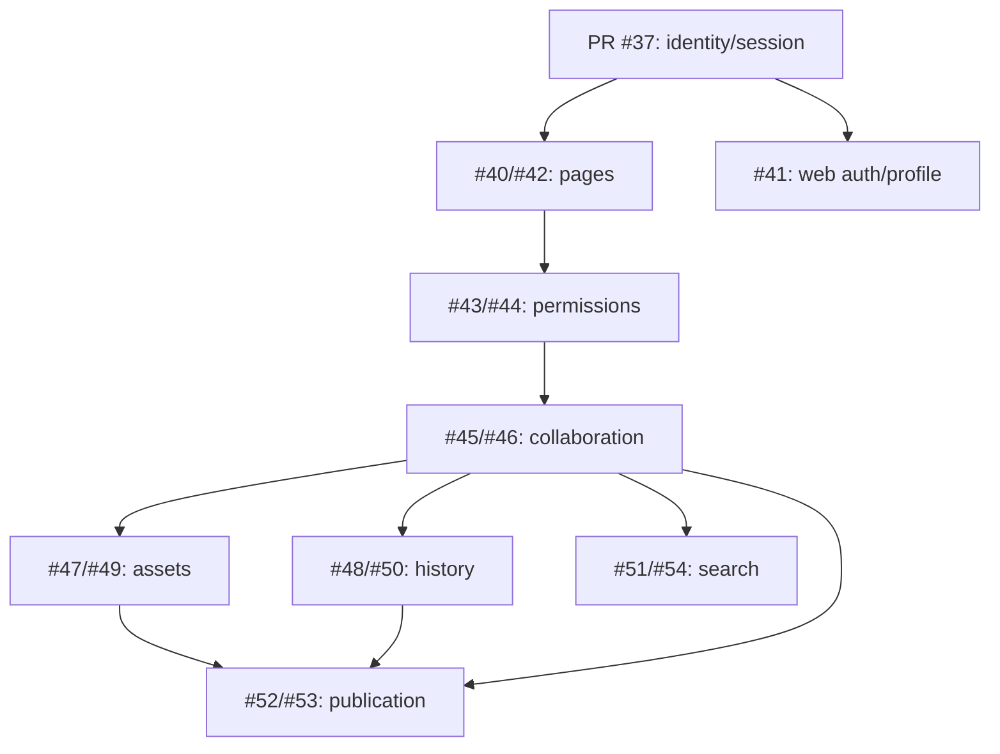

# План на MVP

Документ фиксирует актуальный объём MVP, порядок реализации и связи между задачами. Архитектурный источник истины — [схема базы данных](database-schema.md), новый backlog собран в рамках [#39](https://github.com/itbooster-project-group/lite-notion/issues/39).

Схематичные интерфейсы каждого продуктового этапа находятся в документе [Схемы экранов MVP](mvp-screens.md).

## Принцип: вертикальные работающие срезы

Каждый продуктовый этап проходит через необходимые слои — данные, backend или realtime и web — и завершается сценарием, который можно проверить целиком. Модели и миграции добавляются вместе с использующей их возможностью, а не одной общей миграцией на весь будущий продукт.

Этап считается закрытым, когда:

- данные сохраняются с ограничениями из схемы;
- API или realtime layer проверяет аутентификацию и права;
- интерфейс покрывает основной, ошибочный и read-only сценарии;
- OpenSpec change, тесты и обязательные проверки прошли review.

## Что входит в MVP

1. **Identity** — регистрация, вход, выход, профиль, session и refresh-token rotation.
2. **Страницы** — дерево произвольной глубины, fractional ordering и soft delete.
3. **Доступ** — прямые и наследуемые разрешения `viewer/editor`.
4. **Совместный редактор** — TipTap поверх ProseMirror, Yjs, Hocuspocus, cursors и presence.
5. **Assets** — аватары, обложки и media nodes в приватном object storage.
6. **История** — immutable snapshots, preview и восстановление версии.
7. **Поиск** — PostgreSQL full-text search по доступным страницам.
8. **Публикация** — immutable публичная версия страницы по `/p/:slug`.

## Что не входит в MVP

- самостоятельная сущность `TASK`, список задач и task management API;
- comments, calendar events, notifications, invitations, audit log и AI history;
- workspace/team roles, transfer ownership и публичное совместное редактирование;
- Redis/pub-sub и горизонтальное масштабирование Hocuspocus;
- durable журнал Yjs updates и point-in-time recovery между snapshots;
- semantic/vector search, пароли и срок действия публичных ссылок.

TipTap `taskList` и `taskItem` остаются обычными узлами документа и не создают строки `TASK` в PostgreSQL.

## Этап 0. Инженерный фундамент

Фундамент уже находится в `main` и не является отдельным продуктовым срезом.

| Работа | Результат |
| --- | --- |
| Монорепозиторий pnpm, Next.js и NestJS | [#1](https://github.com/itbooster-project-group/lite-notion/issues/1) |
| Обязательные CI-проверки | [#3](https://github.com/itbooster-project-group/lite-notion/issues/3) |
| Tailwind, shadcn/ui и FSD tooling | [#4](https://github.com/itbooster-project-group/lite-notion/issues/4), [#5](https://github.com/itbooster-project-group/lite-notion/issues/5) |
| Конфигурация и HTTP foundation API | [#8](https://github.com/itbooster-project-group/lite-notion/issues/8) |
| PostgreSQL, Prisma и generated API client | [#32](https://github.com/itbooster-project-group/lite-notion/issues/32) |
| Утверждённая schema-driven модель | [PR #38](https://github.com/itbooster-project-group/lite-notion/pull/38) |

## Этап 1. Identity и профиль

Пользователь регистрируется, входит, восстанавливает сессию, выходит и управляет базовыми данными профиля.

| Слой | Состав |
| --- | --- |
| Данные | `USERS`, `USER_PROFILES`, `SESSIONS`, `REFRESH_TOKENS` |
| Backend | [PR #37](https://github.com/itbooster-project-group/lite-notion/pull/37) — identity/session implementation |
| Web | [#41](https://github.com/itbooster-project-group/lite-notion/issues/41) — регистрация, вход и профиль |

PR #37 уже находится в работе, поэтому новая backend issue не создаётся. До merge его Prisma-модели должны быть согласованы со схемой: профиль отделён от identity, session отделена от refresh-token rotation, а refresh token хранится только как hash.

## Этап 2. Страницы и дерево

Пользователь создаёт root и дочерние страницы, меняет их порядок и перемещает subtree внутри одного дерева владельца.

| Слой | Состав |
| --- | --- |
| Данные и API | [#40](https://github.com/itbooster-project-group/lite-notion/issues/40) — `PAGES`, hierarchy, fractional position и soft delete |
| Web | [#42](https://github.com/itbooster-project-group/lite-notion/issues/42) — workspace, дерево, breadcrumbs и действия страницы |

Перемещение не может создавать цикл или менять владельца subtree. Soft delete выполняется application service для всего поддерева.

## Этап 3. Доступ к страницам

Владелец делится страницей с существующим пользователем и назначает роль `viewer` или `editor`.

| Слой | Состав |
| --- | --- |
| Данные и API | [#43](https://github.com/itbooster-project-group/lite-notion/issues/43) — `PAGE_PERMISSIONS` и effective access |
| Web | [#44](https://github.com/itbooster-project-group/lite-notion/issues/44) — управление прямыми и наследуемыми разрешениями |

`access_mode = inherit` ищет grant у родителей, `restricted` останавливает наследование. Публичная публикация не является permission grant и не открывает рабочий editor.

## Этап 4. Совместный редактор

Несколько пользователей редактируют один документ в realtime согласно effective permission.

| Слой | Состав |
| --- | --- |
| Данные и realtime | [#45](https://github.com/itbooster-project-group/lite-notion/issues/45) — `PAGE_DOCUMENTS`, Hocuspocus auth и Yjs persistence |
| Web | [#46](https://github.com/itbooster-project-group/lite-notion/issues/46) — TipTap/Yjs editor, reconnect, cursors и presence |

Рабочий источник истины — `Y.Doc`; PostgreSQL хранит полный `yjs_state`. Отдельной таблицы `BLOCKS` и REST CRUD блоков нет. Presence остаётся ephemeral и не сохраняется в БД.

## Этап 5. Assets

Пользователь загружает аватар, обложку и media nodes, не раскрывая приватные storage keys.

| Слой | Состав |
| --- | --- |
| Данные и API | [#47](https://github.com/itbooster-project-group/lite-notion/issues/47) — `ASSETS`, object storage и `PAGE_ASSETS` projection |
| Web | [#49](https://github.com/itbooster-project-group/lite-notion/issues/49) — avatar, cover и media nodes |

`PAGE_ASSETS` является derived projection из persisted Yjs document. Доступ к файлам выдаётся permission-aware signed URL; постоянные публичные URL в БД не хранятся.

## Этап 6. История версий

Пользователь открывает immutable snapshot и восстанавливает его как новую актуальную версию.

| Слой | Состав |
| --- | --- |
| Данные и API | [#48](https://github.com/itbooster-project-group/lite-notion/issues/48) — `DOCUMENT_SNAPSHOTS` и restore flow |
| Web | [#50](https://github.com/itbooster-project-group/lite-notion/issues/50) — history panel, preview и restore confirmation |

Restore не переписывает историю назад: он создаёт новый current Y.Doc и snapshot с reason `restore`.

## Этап 7. Поиск

Пользователь ищет текст только среди доступных ему страниц.

| Слой | Состав |
| --- | --- |
| Данные и API | [#51](https://github.com/itbooster-project-group/lite-notion/issues/51) — `PAGE_SEARCH_DOCUMENTS`, GIN index и permission-safe query |
| Web | [#54](https://github.com/itbooster-project-group/lite-notion/issues/54) — search dialog и навигация к результату |

Search document — derived projection с `source_storage_revision`. Перед возвратом результата backend повторно вычисляет effective permission.

## Этап 8. Публикация

Editor публикует конкретную immutable версию, а гость открывает её без editor и realtime runtime.

| Слой | Состав |
| --- | --- |
| Данные и API | [#52](https://github.com/itbooster-project-group/lite-notion/issues/52) — publication snapshot, `DOCUMENT_RENDERINGS` и `PAGE_PUBLICATIONS` |
| Web | [#53](https://github.com/itbooster-project-group/lite-notion/issues/53) — publish controls и публичный SSR route `/p/:slug` |

Publish получает актуальный Y.Doc у Hocuspocus, формирует из него binary snapshot и TipTap JSON и только затем транзакционно переключает публикацию. Live-изменения не появляются публично до следующего publish.

## Зависимости и параллельная работа

После этапа collaboration направления assets, history и search можно выполнять параллельно. Publication выполняется после collaboration, assets и snapshot foundation, поскольку публичный renderer должен получить готовую immutable representation и корректно показать media.

Frontend может заранее готовить presentation components и состояния на mocks, но интеграционный этап закрывается только после готовности соответствующего backend/realtime слоя.
