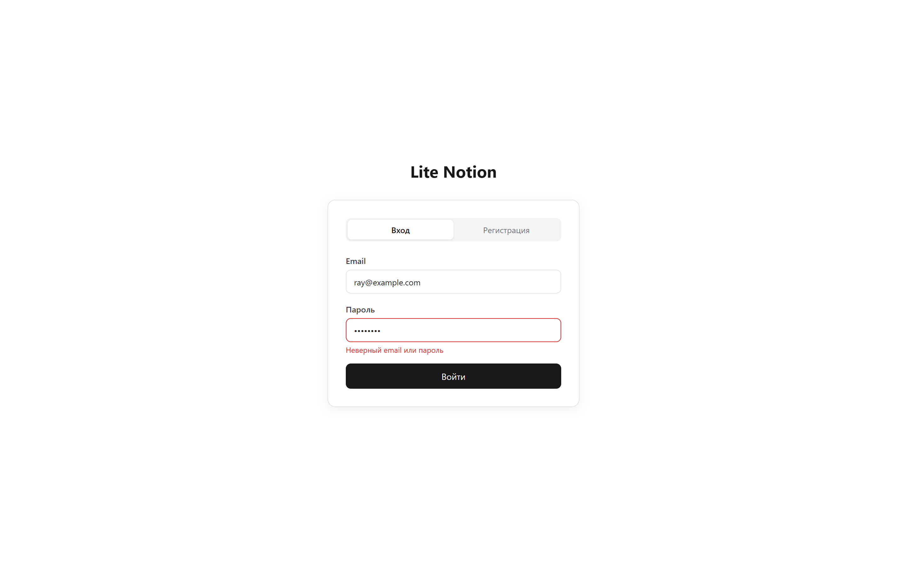
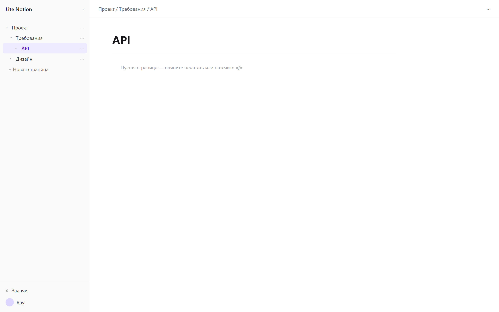
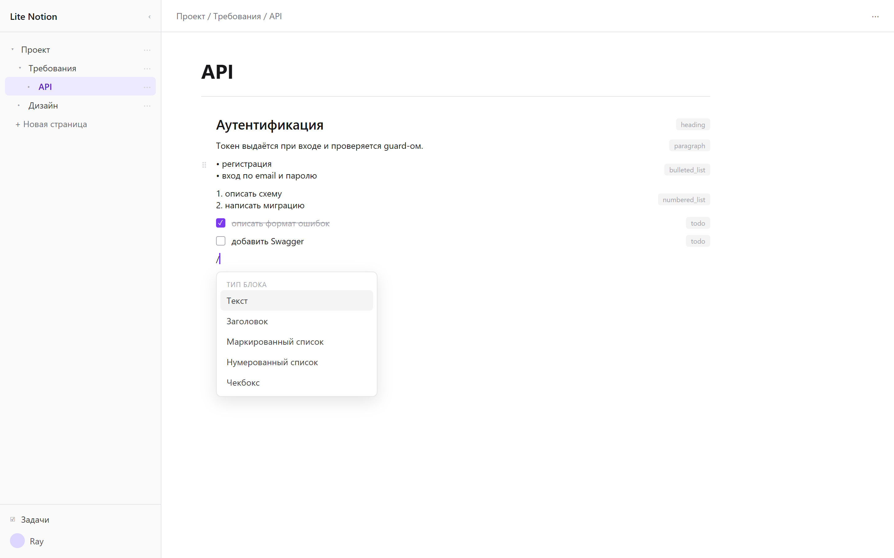
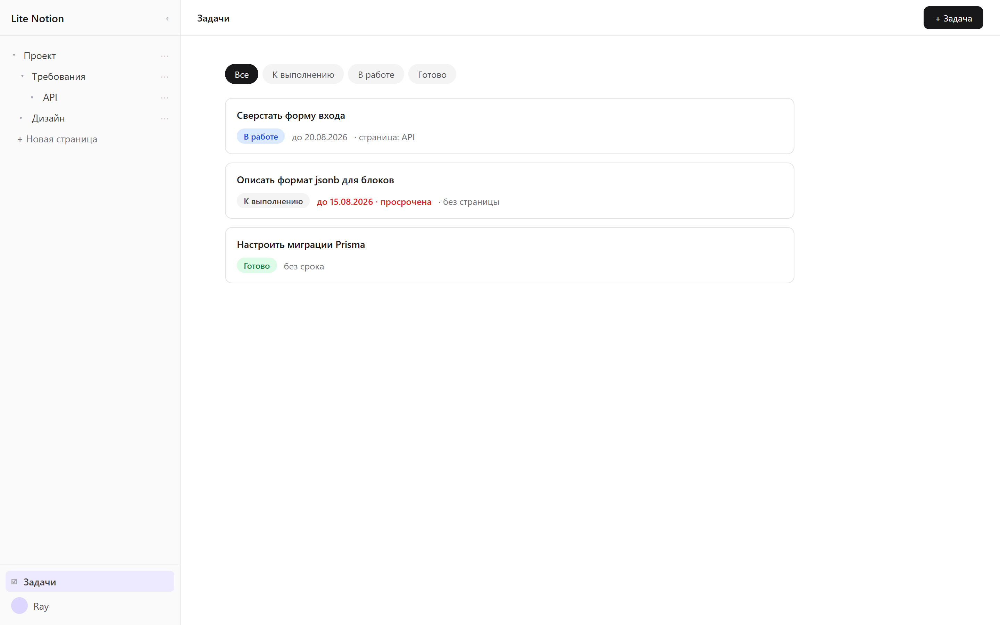
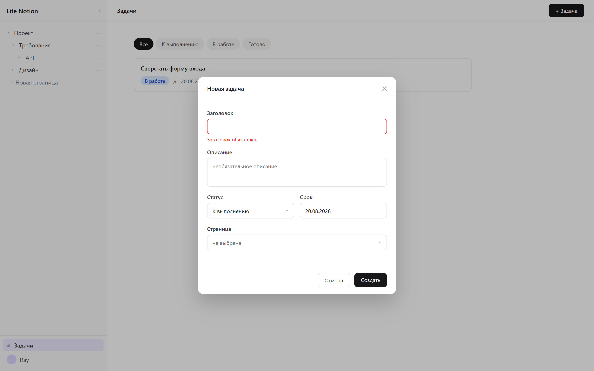
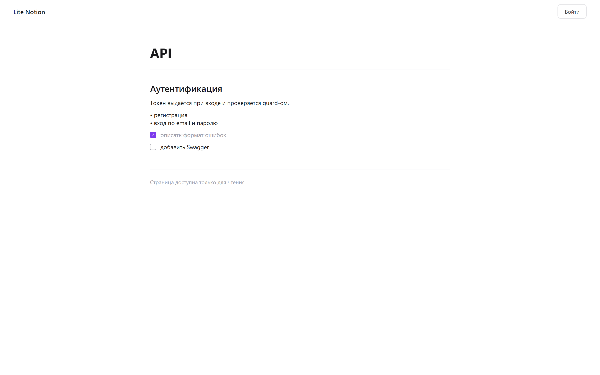

# Схемы экранов MVP

Схематичные макеты интерфейса — по одному на каждый этап из [плана MVP](mvp-plan.md). Это наброски состава и расположения элементов, а не готовый дизайн: типографика, отступы и цвета определяются при вёрстке на shadcn/ui.

Макеты нарисованы под стандартный ноутбучный экран — 1440 × 900. Под каждой картинкой свёрнута та же схема в текстовом виде: её удобно править прямо в Pull Request, когда меняется состав элементов.

Модель данных, на которую опираются экраны, описана в [схеме базы данных](database-schema.md).

## Этап 1. Вход и регистрация

Две вкладки на одном экране. Неавторизованный пользователь попадает сюда с любого приватного маршрута.



Вкладка «Регистрация» добавляет поля «Имя» и «Повтор пароля». Ошибки валидации показываются под полем, ошибка от API — над кнопкой. Сообщение об ошибке входа не раскрывает, существует ли такой email.

<details>
<summary>Та же схема в текстовом виде</summary>

```text
┌──────────────────────────────────────────────────────────────┐
│                                                              │
│                        Lite Notion                           │
│                                                              │
│            ┌──────────────────────────────────┐              │
│            │   [ Вход ]    Регистрация        │              │
│            ├──────────────────────────────────┤              │
│            │                                  │              │
│            │   Email                          │              │
│            │   ┌──────────────────────────┐   │              │
│            │   │ ray@example.com          │   │              │
│            │   └──────────────────────────┘   │              │
│            │                                  │              │
│            │   Пароль                         │              │
│            │   ┌──────────────────────────┐   │              │
│            │   │ ********                 │   │              │
│            │   └──────────────────────────┘   │              │
│            │   ! Неверный email или пароль    │              │
│            │                                  │              │
│            │   ┌──────────────────────────┐   │              │
│            │   │           Войти          │   │              │
│            │   └──────────────────────────┘   │              │
│            │                                  │              │
│            └──────────────────────────────────┘              │
│                                                              │
└──────────────────────────────────────────────────────────────┘
```

</details>

## Этап 2. Рабочая область и дерево страниц

Каркас приложения: сворачиваемый сайдбар с деревом страниц слева, содержимое справа. Этот layout используется на всех приватных экранах.



- Вложенность произвольной глубины через `PAGE.parent_id`; активная страница подсвечена.
- `⋯` у строки дерева — меню действий: создать вложенную, переименовать, удалить.
- `⋯` в шапке — действия страницы, включая публикацию для гостевого доступа.
- `‹` сворачивает сайдбар; на узких экранах он открывается оверлеем.

<details>
<summary>Та же схема в текстовом виде</summary>

```text
┌─────────────────────┬────────────────────────────────────────┐
│ Lite Notion     [<] │  Проект / Требования / API        [...]│
├─────────────────────┼────────────────────────────────────────┤
│                     │                                        │
│  v Проект       [+] │  API                                   │
│    v Требования [+] │  ────────────────────────────────      │
│      - API      [+] │                                        │
│    - Дизайн     [+] │  Пустая страница — начните печатать    │
│                     │                                        │
│  + Новая страница   │                                        │
│                     │                                        │
│                     │                                        │
├─────────────────────┤                                        │
│  Задачи             │                                        │
│  ─────────────────  │                                        │
│  Ray          [вых] │                                        │
└─────────────────────┴────────────────────────────────────────┘
     сайдбар                    рабочая область
```

</details>

## Этап 3. Блочный редактор

Основная рабочая поверхность. Показаны все пять типов блоков MVP и меню выбора типа, открытое по вводу `/`.



- Подписи справа (`heading`, `paragraph`, `bulleted_list`, `numbered_list`, `todo`) — пояснение к макету, а не элемент интерфейса; они соответствуют значениям enum `block_type`.
- `⠿` — ручка перетаскивания, появляется при наведении; поддерживается клавиатурная альтернатива.
- Ввод `/` в пустом блоке открывает меню выбора типа с поиском и навигацией стрелками.
- Порядок блоков хранится в `sort_order`, вложенность — в `parent_block_id`.

<details>
<summary>Та же схема в текстовом виде</summary>

```text
┌─────────────────────┬────────────────────────────────────────┐
│ Lite Notion     [<] │  Проект / Требования / API        [...]│
├─────────────────────┼────────────────────────────────────────┤
│                     │                                        │
│  v Проект       [+] │  API                                   │
│    v Требования [+] │  ────────────────────────────────      │
│      - API      [+] │                                        │
│    - Дизайн     [+] │  ## Аутентификация          heading    │
│                     │                                        │
│  + Новая страница   │  Обычный текст блока       paragraph   │
│                     │                                        │
│                     │  * первый пункт        bulleted_list   │
│                     │  * второй пункт                        │
│                     │                                        │
│                     │ ::  1. первый          numbered_list   │
│                     │     2. второй                          │
│                     │                                        │
│                     │  [ ] не выполнено              todo    │
│                     │  [x] выполнено                         │
│                     │                                        │
│                     │  /                                     │
│                     │  ┌──────────────────────────┐          │
│                     │  │ Текст                    │          │
│                     │  │ Заголовок                │          │
│                     │  │ Маркированный список     │          │
│                     │  │ Нумерованный список      │          │
│                     │  │ Чекбокс                  │          │
│                     │  └──────────────────────────┘          │
└─────────────────────┴────────────────────────────────────────┘
```

</details>

## Этап 4. Задачи

Сквозной список задач владельца с фильтрами по статусу.



- Фильтры соответствуют enum `task_status`.
- Статус меняется прямо в карточке, без открытия формы.
- Просроченная задача выделена: срок в прошлом и статус не `DONE`.
- Исполнителей и аватаров нет — в MVP у задачи один владелец, он же исполнитель.

Форма создания и редактирования открывается модальным окном:



Привязка к странице необязательна: задача может быть личной и не относиться ни к какому документу.

<details>
<summary>Те же схемы в текстовом виде</summary>

```text
┌─────────────────────┬────────────────────────────────────────┐
│ Lite Notion     [<] │  Задачи                     [+ Задача] │
├─────────────────────┼────────────────────────────────────────┤
│                     │  [ Все ] К выполнению  В работе  Готово│
│  v Проект       [+] │  ────────────────────────────────      │
│    v Требования [+] │                                        │
│      - API      [+] │  ┌──────────────────────────────────┐  │
│    - Дизайн     [+] │  │ Сверстать форму входа            │  │
│                     │  │ [В работе v]  до 20.08           │  │
│  + Новая страница   │  │ страница: API                    │  │
│                     │  └──────────────────────────────────┘  │
│                     │                                        │
│                     │  ┌──────────────────────────────────┐  │
├─────────────────────┤  │ Описать формат jsonb             │  │
│  Задачи             │  │ [К выполнению v]  до 15.08 !     │  │
│  ─────────────────  │  │ без страницы                     │  │
│  Ray          [вых] │  └──────────────────────────────────┘  │
└─────────────────────┴────────────────────────────────────────┘
```

```text
        ┌────────────────────────────────────────┐
        │  Новая задача                      [x] │
        ├────────────────────────────────────────┤
        │  Заголовок                             │
        │  ┌──────────────────────────────────┐  │
        │  │                                  │  │
        │  └──────────────────────────────────┘  │
        │  ! Заголовок обязателен                │
        │                                        │
        │  Описание                              │
        │  ┌──────────────────────────────────┐  │
        │  │                                  │  │
        │  └──────────────────────────────────┘  │
        │                                        │
        │  Статус            Срок                │
        │  [К выполнению v]  [ 20.08.2026 ]      │
        │                                        │
        │  Страница                              │
        │  [ не выбрана             v ]          │
        │                                        │
        │            [ Отмена ]  [ Создать ]     │
        └────────────────────────────────────────┘
```

</details>

## Этап 5. Гостевой просмотр

Публичная страница по ссылке, доступна без авторизации.



- Сайдбар, ручки перетаскивания, меню типов и действия страницы не скрыты стилями, а вовсе не отрендерены.
- Блоки рендерятся теми же компонентами в режиме только для чтения; чекбоксы отображаются, но не переключаются.
- Неопубликованная и несуществующая страница отвечают одинаково, не раскрывая факт существования.

<details>
<summary>Та же схема в текстовом виде</summary>

```text
┌──────────────────────────────────────────────────────────────┐
│  Lite Notion                                  [ Войти ]      │
├──────────────────────────────────────────────────────────────┤
│                                                              │
│      API                                                     │
│      ──────────────────────────────────────                  │
│                                                              │
│      ## Аутентификация                                       │
│                                                              │
│      Обычный текст блока                                     │
│                                                              │
│      * первый пункт                                          │
│      * второй пункт                                          │
│                                                              │
│      [x] выполнено                                           │
│      [ ] не выполнено                                        │
│                                                              │
│      ────────────────────────────────────                    │
│      Страница доступна только для чтения                     │
│                                                              │
└──────────────────────────────────────────────────────────────┘
```

</details>

## Как перерисовать картинки

Макеты сгенерированы из HTML headless-браузером, исходник лежит в [`docs/screens/generate.js`](screens/generate.js). Чтобы обновить картинки после правки макета:

```bash
npm install puppeteer
node docs/screens/generate.js docs/screens
```

Скрипт рендерит все экраны в разрешении 1440 × 900 с двукратной плотностью пикселей.
