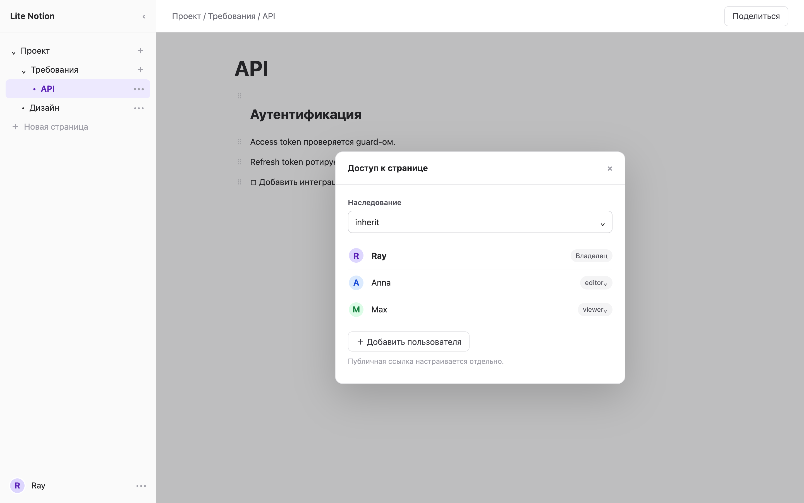
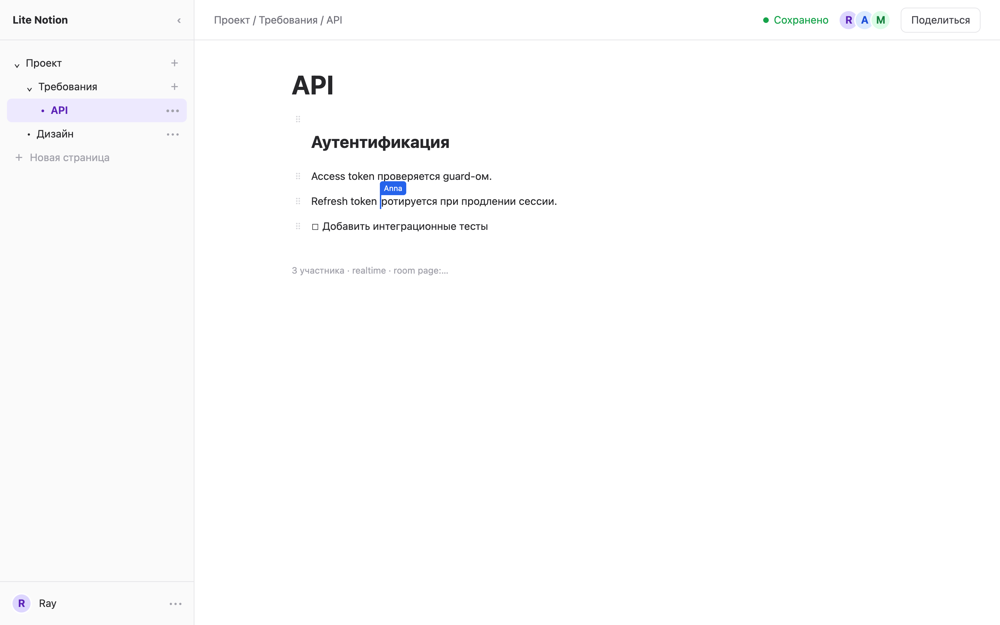
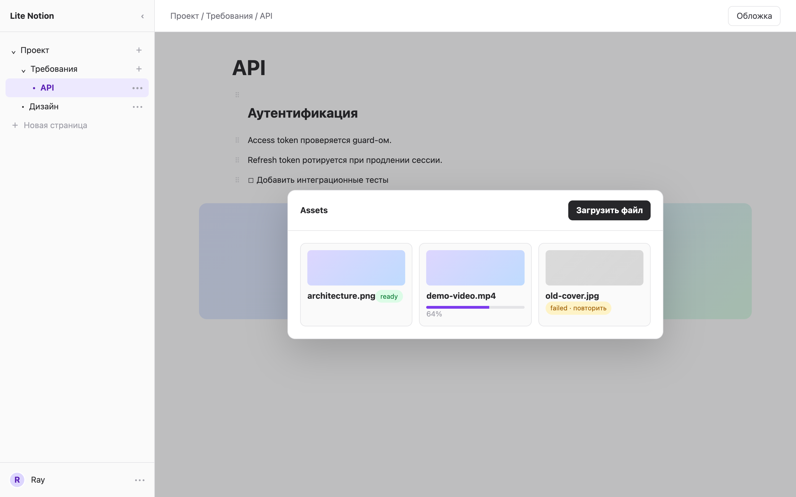
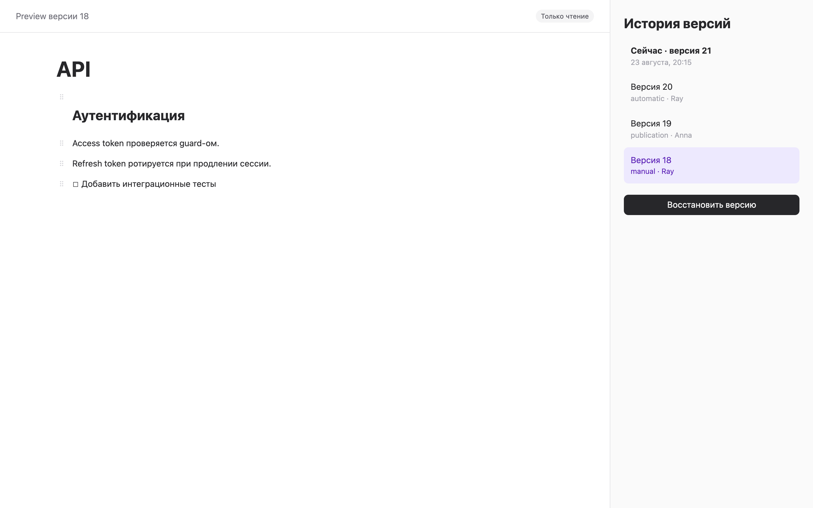
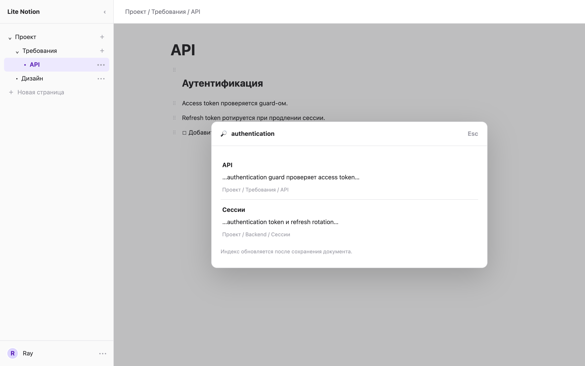
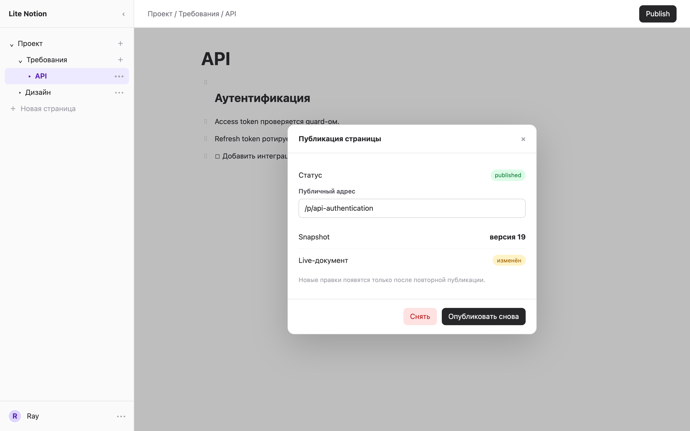
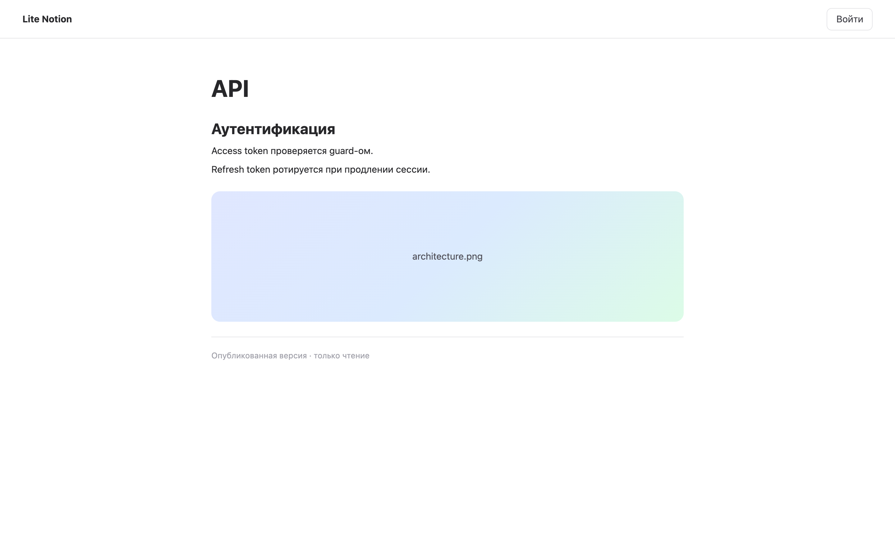

# Схемы экранов MVP

Макеты показывают состав schema-driven MVP из [поэтапного плана](mvp-plan.md). Это функциональные wireframes, а не финальный визуальный дизайн: типографика, цвета и точные отступы определяются при реализации на shadcn/ui.

Все макеты рассчитаны на область 1440 × 900. Под каждой картинкой находится та же схема в текстовом виде, чтобы изменения поведения можно было проверить прямо в Pull Request.

## Этап 1. Вход и профиль

Неавторизованный пользователь видит формы входа и регистрации. После входа меню пользователя показывает профиль и действие завершения текущей сессии.


```text
┌──────────────────────────────────────────────────────────────┐
│                         Lite Notion                          │
│              ┌──────────────────────────────┐                │
│              │ [ Вход ]    Регистрация      │                │
│              │ Email       ray@example.com  │                │
│              │ Пароль      ••••••••         │                │
│              │ ! Неверные учётные данные    │                │
│              │          [ Войти ]           │                │
│              └──────────────────────────────┘                │
│ После входа: [аватар] Ray · Профиль · Выйти                  │
└──────────────────────────────────────────────────────────────┘
```

## Этап 2. Рабочая область и дерево страниц

Сайдбар отображает root и дочерние страницы, их порядок и активный маршрут. В основной области находятся cover, breadcrumbs, заголовок и будущий editor.


```text
┌──────────────────────┬───────────────────────────────────────┐
│ Lite Notion      [‹] │ Проект / Требования / API       [•••] │
├──────────────────────┼───────────────────────────────────────┤
│ ▾ Проект         [+] │ ┌──────────── cover ────────────────┐ │
│   ▾ Требования   [+] │ └───────────────────────────────────┘ │
│     • API        [••]│ API                                   │
│   • Дизайн       [••]│                                       │
│ + Новая страница     │ Выберите страницу или начните ввод    │
│                      │                                       │
├──────────────────────┤                                       │
│ [аватар] Ray         │                                       │
└──────────────────────┴───────────────────────────────────────┘
```

## Этап 3. Управление доступом

Диалог отделяет прямые grants от унаследованного доступа и публичной ссылки. Владелец выбирает `viewer/editor` и режим `inherit/restricted`.



```text
┌──────────────────────────────────────────────────────────────┐
│ API                                                    [•••] │
│                         ┌──────────────────────────────┐     │
│                         │ Доступ к странице           │     │
│                         │ Наследование: [inherit  ▾]  │     │
│                         │                              │     │
│                         │ Ray          Владелец       │     │
│                         │ Anna         editor     [▾] │     │
│                         │ Max          viewer     [▾] │     │
│                         │                              │     │
│                         │ [ Добавить пользователя ]   │     │
│                         │ Публикация настраивается    │     │
│                         │ отдельно                    │     │
│                         └──────────────────────────────┘     │
└──────────────────────────────────────────────────────────────┘
```

## Этап 4. Совместный редактор

TipTap подключён к Yjs room страницы. Верхняя панель показывает состояние соединения и участников; remote cursors видны в документе, viewer получает read-only режим.



```text
┌──────────────────────┬───────────────────────────────────────┐
│ Дерево страниц       │ API                 ● Сохранено       │
│                      │                     [R][A][M] Поделиться│
│ • API                │ # Аутентификация                      │
│                      │                                       │
│                      │ Access token проверяется guard-ом.    │
│                      │                    ┌─ Anna             │
│                      │ Refresh token ротир|уется              │
│                      │                                       │
│                      │ ⠿ [ ] Добавить тесты                  │
│                      │                                       │
│                      │ 3 участника · realtime                │
└──────────────────────┴───────────────────────────────────────┘
```

## Этап 5. Assets

Asset picker показывает upload progress и состояния файлов. Media node хранит `asset_id`, а editor controls скрыты в read-only режиме.



```text
┌──────────────────────────────────────────────────────────────┐
│ API                                               [ Cover ]  │
│                                                              │
│      ┌──────────────────── Assets ─────────────────────┐     │
│      │ [ Загрузить файл ]                              │     │
│      │ architecture.png     ready          [ Выбрать ] │     │
│      │ demo-video.mp4       64%            [ Отмена ]  │     │
│      │ old-cover.jpg        failed         [ Повторить] │     │
│      └─────────────────────────────────────────────────┘     │
│                                                              │
│      ┌──────── image media node · architecture.png ───┐     │
│      └─────────────────────────────────────────────────┘     │
└──────────────────────────────────────────────────────────────┘
```

## Этап 6. История версий

Панель истории открывает immutable preview. Восстановление требует подтверждения и создаёт новую актуальную версию, не удаляя старые snapshots.



```text
┌───────────────────────────────────┬──────────────────────────┐
│ Preview версии 18                 │ История версий           │
│ 23 августа, 18:40 · manual        │ ● Сейчас · версия 21     │
│                                   │   версия 20 · automatic  │
│ # API                             │   версия 19 · publication│
│ Снимок доступен только для чтения │ > версия 18 · manual     │
│                                   │                          │
│                                   │ [ Восстановить версию ]  │
└───────────────────────────────────┴──────────────────────────┘
```

## Этап 7. Полнотекстовый поиск

Search dialog возвращает только страницы с effective permission и предупреждает, что индекс может немного отставать от live document.



```text
┌──────────────────────────────────────────────────────────────┐
│                  ┌────────────────────────────┐              │
│                  │ 🔎 authentication          │              │
│                  ├────────────────────────────┤              │
│                  │ API                        │              │
│                  │ …authentication guard…     │              │
│                  │ Проект / Требования / API  │              │
│                  ├────────────────────────────┤              │
│                  │ Сессии                     │              │
│                  │ …authentication token…     │              │
│                  │ Индекс обновляется         │              │
│                  └────────────────────────────┘              │
└──────────────────────────────────────────────────────────────┘
```

## Этап 8. Настройки публикации

Диалог показывает текущий publication snapshot. Изменения live document требуют явного повторного publish.



```text
┌──────────────────────────────────────────────────────────────┐
│ API                                              [ Publish ] │
│                       ┌───────────────────────────────┐      │
│                       │ Публикация страницы          │      │
│                       │ Статус: published            │      │
│                       │ /p/api-authentication        │      │
│                       │ Snapshot: версия 19          │      │
│                       │ Live-документ изменён        │      │
│                       │                               │      │
│                       │ [ Снять ] [ Опубликовать снова ]     │
│                       └───────────────────────────────┘      │
└──────────────────────────────────────────────────────────────┘
```

## Публичная страница

Route `/p/:slug` серверно рендерит immutable TipTap JSON. Он не загружает editor, Yjs, WebSocket или presence.



```text
┌──────────────────────────────────────────────────────────────┐
│ Lite Notion                                      [ Войти ]  │
├──────────────────────────────────────────────────────────────┤
│                                                              │
│                 API                                          │
│                 ─────────────────────────────                │
│                 # Аутентификация                             │
│                 Access token проверяется guard-ом.           │
│                                                              │
│                 [ architecture.png ]                         │
│                                                              │
│                 Опубликованная версия · read-only            │
└──────────────────────────────────────────────────────────────┘
```

## Генерация PNG

Для генерации всех макетов нужен установленный stable Google Chrome или Chromium. При нестандартном расположении передайте executable path через `PUPPETEER_EXECUTABLE_PATH`.

```bash
pnpm docs:screens
```

Команда использует `docs/screens/generate.js` и перезаписывает девять PNG в `docs/screens`.
